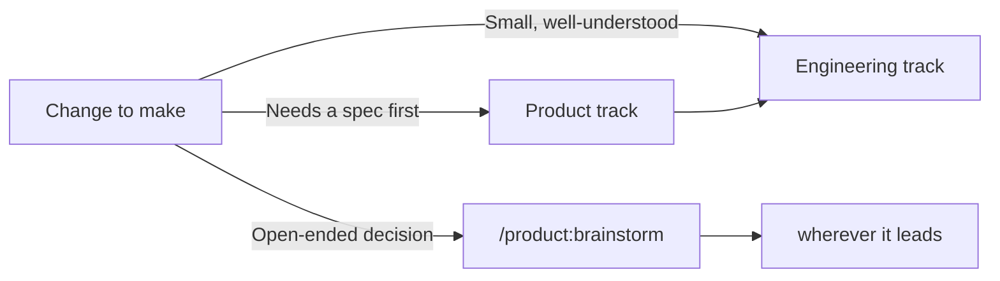
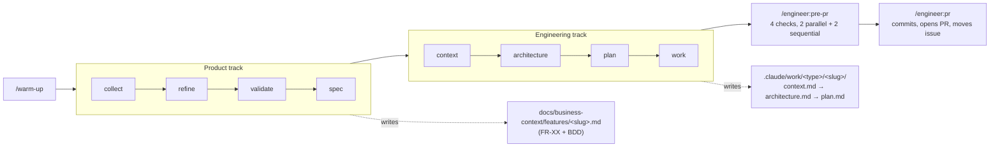
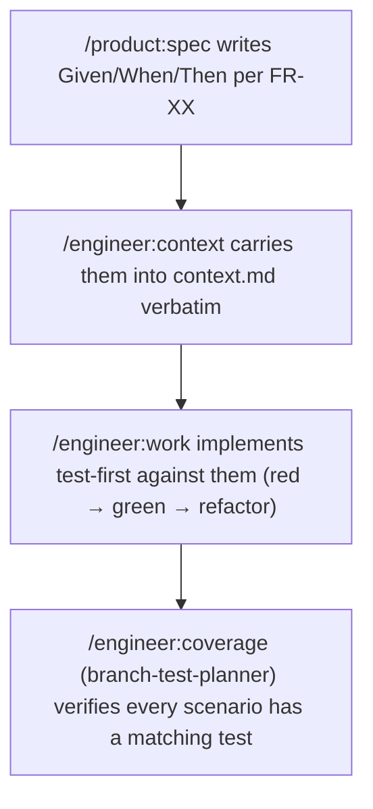
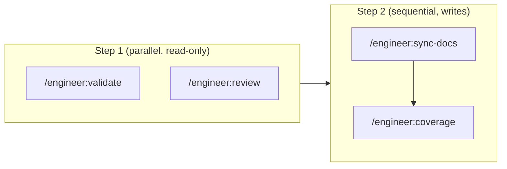

# CoDriDe

<div align="center">
  
  <br/><br/>


**Context Driven Development for Claude Code**

English | [Português (Brasil)](./README_PT-BR.md) | [Español](./README_ES.md)

A structured pipeline — master docs, GitHub Issues, and 8 focused agents — that takes a project from a raw idea to a merged PR.

**Core advantages:** Master Docs as Source of Truth • GitHub-Native • Zero Lock-in Beyond `gh`

</div>

---

## 📖 Project Overview

### What is this?

CoDriDe is a Context Driven Development (CDD) framework for Claude Code: a set of commands and agents (living under `.claude/`) that structure how a project goes from a raw idea to a merged PR — with a persistent, versioned source of truth (**master docs**) that every feature is checked against, and **GitHub Issues** as the system of record for project management.

This repo *is* the framework: there's no application code here. You copy `.claude/` (and `CLAUDE.md`) into the project you actually want to build, and CoDriDe's commands become available there.

### What problems does it solve?

- **Context that evaporates between sessions**: every feature re-derives "how do we build things here" from scratch, and there's nothing to check a change against except a reviewer's memory.
- **No source of truth to check a change against**: without master docs, "does this match our architecture" is a guess, not a check.
- **AI-generated code that drifts from real conventions**: implementation happens without ever reading the ADRs or patterns that already decided how this should be built.

### Use Cases

- 🚀 Structuring a brand-new project from day one, with living master docs from the start
- 🔧 Bringing a disciplined product → engineering pipeline to an existing codebase
- 🧪 BDD/TDD-driven feature work, where acceptance criteria survive from spec to test
- 📐 DDD-aware architecture design for the features whose domain is complex enough to warrant it
- 🗂️ Keeping GitHub Issues honest — synced from the same feature docs that specced the work

---

## ⚡ Quick Start

### Prerequisites

- [Claude Code](https://docs.anthropic.com/en/docs/claude-code)
- [`gh` CLI](https://cli.github.com/), installed and authenticated (`gh auth status`)
- Git

### 5-Step Setup

**Step 1: Get the framework**
```bash
git clone https://github.com/edilson-silva/codride.git
```

**Step 2: Copy it into your project**
```bash
cp -r codride/.claude codride/CLAUDE.md /path/to/your-project/
cd /path/to/your-project
```

**Step 3: Run the health check**
```bash
claude "/engineer:doctor"
```

**Step 4: Scan the codebase (optional, but sharpens everything else)**
```bash
claude "/engineer:discover"
```

**Step 5: Warm up and start**
```bash
claude "/warm-up"
```

### First Feature Example

```bash
claude "/product:collect Users can't reset their password if their email has a plus-alias"
# → creates a GitHub issue

claude "/product:spec 42"
# → expands it into a full PRD with BDD acceptance criteria

claude "/engineer:context fix/password-reset-plus-alias"
# → interview → context.md

claude "/engineer:architecture fix/password-reset-plus-alias"
# → design → architecture.md, cross-checked against context.md

claude "/engineer:plan fix/password-reset-plus-alias"
claude "/engineer:work .claude/work/fix/password-reset-plus-alias"
claude "/engineer:pre-pr"
claude "/engineer:pr"
```

You don't need every piece on day one — `/engineer:context` and `/engineer:architecture` work fine without master docs or a discovery briefing; they just have less context to draw on.

### Onboarding an Existing Project

The 5-step setup above works for any project, but an existing codebase already has signal worth mining — code, README, issues, ADRs — so the bootstrap commands default to analyzing that material first and only interview you to fill the gaps. This is **Analysis mode**; a brand-new/empty project instead runs **Collection mode**, a from-scratch interview (see the [FAQ](#-faq)).

**Steps 1-3: same as the 5-step setup** — copy `.claude/` in, run `/engineer:doctor`, run `/engineer:discover`.

`/engineer:discover` is the fast, automatic pass over the codebase: no interview, safe to re-run incrementally as the code evolves. It writes:
- `docs/technical-context/project-briefing.md` — master index + summary
- `docs/technical-context/briefing/critical-rules.md` — the 3-5 most critical rules, copied in full into every future `context.md`
- `docs/technical-context/briefing/adrs-summary.md` — indexed ADR summaries (created with a "none yet" note if the project has no ADRs)
- `docs/technical-context/briefing/backend-conventions.md` — folder structure, naming, code patterns
- `docs/technical-context/briefing/tech-stack.md` — runtime, framework, database/ORM, key libraries

**Step 4 (optional, deeper): the full technical master doc**
```bash
claude "/bootstrap:tech-docs <links to repo/docs, if any>"
```
Heavier than `/engineer:discover` — it interviews you (~10 questions) about architecture decisions, workflows, and known challenges, then writes the complete technical-context architecture:
- `docs/technical-context/index.md` — master index
- `docs/technical-context/project_charter.md` — vision, success criteria, scope, stakeholders
- `docs/technical-context/adr/` — draft ADRs for decisions it found in the code but that were never written down
- `docs/technical-context/CLAUDE.meta.md` — AI development guide (code style, gotchas, patterns)
- `docs/technical-context/CODEBASE_GUIDE.md` — annotated directory structure, data flow, integrations
- `docs/technical-context/BUSINESS_LOGIC.md` — domain rules and workflows (if complex domain logic exists)
- `docs/technical-context/API_SPECIFICATION.md` — endpoints, auth, data models (if APIs exist)
- `docs/technical-context/CONTRIBUTING.md` — branch strategy, review process, testing requirements
- `docs/technical-context/TROUBLESHOOTING.md` — common issues and debugging approaches
- `docs/technical-context/ARCHITECTURE_CHALLENGES.md` — known pain points and what the team wants to improve

Run `/engineer:discover` alone if you just want `context.md` to have something to draw on quickly; run `/bootstrap:tech-docs` when you want the full "DNA" document written down. Running both is fine — `/engineer:doctor` reports both shapes present, it doesn't treat it as a conflict.

**Step 5: the business side**
```bash
claude "/bootstrap:business-docs <links to the product's docs/tickets, if you have them>"
```
With existing material to mine (a README with a real product description, GitHub issues, marketing pages), this runs in Analysis mode: it researches the product, market, and customers, asks a round of clarifying questions, then writes:
- `docs/business-context/index.md` — master index
- `docs/business-context/CUSTOMER_PERSONAS.md`
- `docs/business-context/CUSTOMER_JOURNEY.md`
- `docs/business-context/VOICE_OF_CUSTOMER.md`
- `docs/business-context/PRODUCT_STRATEGY.md`
- `docs/business-context/features/` — one file per existing feature
- `docs/business-context/PRODUCT_METRICS.md`
- `docs/business-context/COMPETITIVE_LANDSCAPE.md`
- `docs/business-context/INDUSTRY_TRENDS.md`
- `docs/business-context/SALES_PROCESS.md` (if relevant)
- `docs/business-context/MESSAGING_FRAMEWORK.md`
- `docs/business-context/CUSTOMER_COMMUNICATION.md`

If an "existing" repo turns out to have little or nothing to mine (a bare scaffold, a pre-launch idea), both bootstrap commands fall back to Collection mode automatically — same as a brand-new project.

**Step 6: warm up and start the pipeline**
```bash
claude "/warm-up"
```
From here, CoDriDe treats an existing project exactly like a new one — `/product:collect`, `/engineer:context`, and the rest of the pipeline all draw on the master docs just generated.

---

## 💡 Core Concepts

### Context Driven Development

> **We used to trust a reviewer's memory. Now we trust the master docs — and check every feature against them, before it's built and again before it ships.**

CoDriDe treats two artifacts as load-bearing:

1. **Master docs are the project's DNA.** A small set of living documents (business context + technical context) captures the decisions that matter — product strategy, personas, ADRs, conventions. Every feature gets checked against them before it's built (`/product:validate`) and again before it ships (`/engineer:validate`, part of `/engineer:pre-pr`).
2. **Every unit of work leaves a paper trail.** `/engineer:context` and `/engineer:architecture` write `context.md` and `architecture.md`, and `/engineer:plan` writes a phased `plan.md`, into `.claude/work/<type>/<slug>/` — and this isn't just for features. `<type>` follows [Conventional Commits](https://www.conventionalcommits.org/) (`feat`, `fix`, `docs`, `chore`, `refactor`, `test`, `perf`, `build`, `ci`, `style`, `revert`), so a bug fix's work item lives at `.claude/work/fix/<slug>/`, matching the branch name. If work gets interrupted — a new chat, a different day, a different engineer — the next person reads its files and knows exactly where things stand.

Project management runs through **GitHub Issues** via the `gh` CLI — no separate PM tool to keep in sync by hand.

### Routing: Product Track vs. Engineering Track

CoDriDe doesn't auto-detect complexity — you choose the entry point, and that choice is cheap to get "wrong" because both tracks are just commands:



A feature typically flows **left to right**: an idea gets collected and refined on the product side, then handed to the engineering side once there's a clear spec to build against.

### Agent Collaboration Model

| Agent | Responsibility | Trigger Condition |
|---|---|---|
| `branch-master-docs-checker` | Checks the branch against master docs | `/engineer:validate` (standalone or via `/engineer:pre-pr`) |
| `branch-code-reviewer` | Code quality, bugs, security, dependency audit | `/engineer:review` |
| `branch-documentation-writer` | Keeps user-facing docs (README, API reference, usage examples) in sync with code changes | `/engineer:sync-docs` |
| `branch-test-planner` | Finds missing test coverage, including BDD scenario gaps | `/engineer:coverage` |
| `adr-compliance-checker` | Validates code against the project's ADRs | `/engineer:discover`, `/engineer:work` |
| `github-project-sync` | Syncs feature docs with GitHub Issues | `/product:sync-github` |
| `python-developer` | Idiomatic Python implementation | On demand, non-trivial Python work |
| `typescript-developer` | Idiomatic TypeScript/JavaScript implementation | On demand, non-trivial TS/JS work |

These 8 are CoDriDe's portable core — unprefixed names. Anything created via `/meta:create-agent` is project-specific and gets a `project-` prefix instead (see [Advanced Configuration](#️-advanced-configuration)) — that prefix is the only thing distinguishing the two, since `.claude/agents/` doesn't support subdirectories.

---

## 📋 Command Reference

Commands are invoked as `/<folder>:<file>`, e.g. `.claude/commands/product/spec.md` → `/product:spec`. `/warm-up` lives at the top level, so it's just `/warm-up`.

<details>
<summary><strong>Setup</strong> — <code>/warm-up</code>, <code>/engineer:doctor</code>, <code>/engineer:discover</code></summary>

#### `/warm-up`
Loads both halves of the master docs — product (`docs/business-context/`) and engineering (`docs/technical-context/`) — plus the root `README.md`, so the session starts with the right context loaded. It reads index/entry-point files only, not everything they point to. If a piece doesn't exist yet, it says so and moves on.

- **Usage**: `/warm-up` (project name is optional, only useful in a multi-project workspace)
- **Tips**: run this at the start of any session where you'll touch product or architecture decisions. Skip it for a one-line bug fix.

#### `/engineer:doctor`
A pre-flight health check, not a fix-it command: reports `gh` auth status, the repo's actual default branch, whether a test suite exists, the state of master docs, GitHub label taxonomy, and whether the repo is a monorepo — all in one pass, without changing anything.

- **Usage**: `/engineer:doctor`
- **Tips**: run it right after copying `.claude/` into a project, whether that project is brand-new or has years of history — on an existing repo it's what surfaces "this isn't `main`, it's `develop`" or "there's no test suite" before those assumptions break a command mid-pipeline instead of at the start.

#### `/engineer:discover`
Scans the codebase once (or incrementally) and writes `docs/technical-context/project-briefing.md` plus `docs/technical-context/briefing/{critical-rules,adrs-summary,backend-conventions,tech-stack}.md`. Detects ADRs, infers architectural conventions, and identifies the stack from the manifest file — then runs `adr-compliance-checker` against the existing codebase, so onboarding an existing project surfaces where the code has already drifted from its own documented decisions.

- **Usage**: `/engineer:discover`, or `/engineer:discover --verbose` for a detailed run
- **Tips**: write your ADRs *before* running this if you can — the more decisions are documented, the more `adr-compliance-checker` has to check against, both here and again later during `/engineer:work`.

</details>

<details>
<summary><strong>Bootstrapping master docs</strong> — <code>/bootstrap:*</code></summary>

Generate the multi-file master-docs architecture from scratch. Use once per project, then maintain by hand (or via `/engineer:sync-docs`).

#### `/bootstrap:tech-docs`
Generates the full technical-context architecture (project charter, ADRs, AI dev guide, codebase navigation, business logic, API spec, contributing guide, troubleshooting) under `docs/technical-context/`. Analyzes the local codebase on its own — arguments are optional, only needed to point it at material outside this repo.

- **Usage**: `/bootstrap:tech-docs`, or `/bootstrap:tech-docs <links to repos/files to analyze>` to include external material

#### `/bootstrap:business-docs`
Generates the full business-context architecture (personas, journey, voice of customer, product strategy, feature catalog, competitive landscape, sales/messaging guidance) under `docs/business-context/`. Works two ways: **analysis mode** mines material you point it at; **collection mode** runs a founder/PM interview instead, for a brand-new project with nothing to analyze yet.

- **Usage**: `/bootstrap:business-docs <links to product docs, support tickets, existing PRDs, etc.>`, or with no arguments for collection mode.
- **Tips**: in collection mode, everything generated is explicitly marked as an unvalidated hypothesis — re-run it (or use `/product:brainstorm`) once real customers confirm or revise those assumptions.

#### `/bootstrap:index`
Builds or refreshes an `index.md` pointing to every useful documentation file. Detects whether this is a single project or a multi-project docs meta-repo, and adapts accordingly.

- **Usage**: `/bootstrap:index` or `/bootstrap:index <project-name>` (meta-repo mode)

</details>

<details open>
<summary><strong>Product track</strong> — <code>/product:*</code></summary>

#### `/product:collect`
Captures a raw idea or bug report as a GitHub issue, with just enough clarity to recall it later — no full spec yet.

- **Usage**: `/product:collect "users can't reset their password if their email has a plus-alias"`

#### `/product:refine`
Turns a collected requirement into a structured WHY / WHAT / HOW document, through a clarifying-question dialogue.

- **Usage**: `/product:refine 42` (a GitHub issue number) or `/product:refine <path/to/file.md>`

#### `/product:validate`
Validates one or more described features against the project's master docs, reporting what's aligned and what contradicts a specific master doc (with a citation).

- **Usage**: `/product:validate "add social login via Google and GitHub"`
- **Tips**: not to be confused with `/engineer:validate`, which checks the *branch* after the fact — this one checks the *idea*, before anything is built.

#### `/product:spec`
Expands a validated requirement into a full PRD: product overview, functional requirements (numbered `FR-01`, `FR-02`, ...) with BDD acceptance criteria, non-functional requirements, UX and technical considerations, risks, constraints. Also saves `docs/business-context/features/<slug>.md` in the format `/product:sync-github` expects.

- **Usage**: `/product:spec 42`

#### `/product:brainstorm`
A structured, deliberately adversarial brainstorming session for open-ended product or business decisions — generates real alternatives, trade-off and risk matrices, and a grounded recommendation, then stops for human review.

- **Usage**: `/product:brainstorm "should we build a native mobile app or invest in the PWA?"`
- **Tips**: it's the heaviest command in the framework — reserve it for decisions with real alternatives worth weighing.

#### `/product:quick-spec`
Creates a fully-specced GitHub issue directly from a task description, without the multi-step collect → refine → spec dialogue.

- **Usage**: `/product:quick-spec "add rate limiting to the public API, 100 req/min per API key"`

#### `/product:sync-github`
Keeps `docs/business-context/features/*.md` in sync with this repo's GitHub Issues — creates missing issues, updates ones that drifted, flags orphans. Always previews the diff before writing anything.

- **Usage**: `/product:sync-github`, `/product:sync-github module=Billing`, or `/product:sync-github preview`

</details>

<details open>
<summary><strong>Engineering track</strong> — <code>/engineer:*</code></summary>

#### `/engineer:context`
Kicks off a unit of work: an interview to build shared understanding, written to `context.md`. First of a two-step pair with `/engineer:architecture`.

- **Usage**: `/engineer:context feat/csv-order-export` — argument is `<type>/<slug>`

#### `/engineer:architecture`
Reads `context.md` and designs the implementation, written to `architecture.md`, with a mandatory consistency check between the two documents before you approve.

- **Usage**: `/engineer:architecture feat/csv-order-export`

#### `/engineer:plan`
Turns `context.md` + `architecture.md` into a phased `plan.md`, each phase sized to roughly 2 hours of human work, resumable if interrupted.

- **Usage**: `/engineer:plan feat/csv-order-export`

#### `/engineer:work`
Executes the next phase of `plan.md`, keeps the GitHub issue's status label in sync in real time, and implements test-first against any BDD acceptance criteria.

- **Usage**: `/engineer:work .claude/work/feat/csv-order-export`

#### `/engineer:pre-pr`
An orchestrator, not a check of its own: runs `/engineer:validate` and `/engineer:review` in parallel, then `/engineer:sync-docs` and `/engineer:coverage` sequentially — and helps you act on their combined feedback.

- **Usage**: `/engineer:pre-pr`

#### `/engineer:validate` / `/engineer:review` / `/engineer:sync-docs` / `/engineer:coverage`
One-line shortcuts that invoke `branch-master-docs-checker` / `branch-code-reviewer` / `branch-documentation-writer` / `branch-test-planner` directly — each also runs standalone, without the full `/engineer:pre-pr` sweep. Note the split: `/engineer:validate` checks the branch against the internal master docs (business/technical context, the project's "DNA"); `/engineer:sync-docs` updates the external, user-facing docs instead — README, API reference, usage examples, install/config guides — anything another developer or team would read to understand or integrate the project.

- **Tips**: run `/engineer:coverage` right after a phase while the code is fresh; run `/engineer:review` mid-feature, not just before a PR.

#### `/engineer:pr`
Runs tests, commits, opens the PR, moves the GitHub issue to "in review", and triages automated code-review bot comments with you.

- **Usage**: `/engineer:pr`

#### `/engineer:bump`
Bumps the project's semver version, detecting whether the project uses `pyproject.toml`, `package.json`, or both.

- **Usage**: `/engineer:bump`

#### `/engineer:adr`
Drafts a new Architecture Decision Record under `docs/technical-context/adr/`, checking first for conflicts with or supersession of existing ADRs.

- **Usage**: `/engineer:adr "use event sourcing for the order aggregate"`

</details>

<details>
<summary><strong>Meta</strong> — <code>/meta:create-agent</code></summary>

#### `/meta:create-agent`
Creates a new sub-agent under `.claude/agents/`, named `project-<name>.md` by default (see [Advanced Configuration](#️-advanced-configuration)).

- **Usage**: `/meta:create-agent "an agent that audits our GraphQL schema for breaking changes before merge"` → creates `project-graphql-schema-auditor.md`

</details>

---

## 📚 Usage Guide

### Directory Structure

```
docs/
├── business-context/           # master docs: strategy, personas, feature catalog
│   ├── index.md                 # entry point, generated by /bootstrap:business-docs
│   ├── features/                 # one .md per feature — /product:spec or /product:quick-spec write it,
│   │                             #   /product:sync-github keeps it in sync with GitHub Issues
│   └── brainstorm/               # /product:brainstorm session output
└── technical-context/          # shape depends on which command generated it:
    ├── project-briefing.md      #   /engineer:discover  → compact briefing (+ briefing/*.md below)
    ├── briefing/                 #   critical-rules, adrs-summary, backend-conventions, tech-stack
    ├── index.md                 #   /bootstrap:tech-docs → entry point for the fuller set below
    ├── adr/                      # Architecture Decision Records
    └── project_charter.md, CODEBASE_GUIDE.md, BUSINESS_LOGIC.md, API_SPECIFICATION.md, ...

.claude/
├── agents/                          # the 8 agents above (+ project-*.md you add)
├── commands/                        # engineer/, product/, bootstrap/, meta/, warm-up.md
├── work/<type>/<slug>/               # context.md, architecture.md, plan.md per in-flight work item
│   ├── feat/csv-order-export/        # e.g. a feature
│   └── fix/password-reset-plus-alias/ # e.g. a bug fix
└── rules/product-agent.mdc          # always-on PM/architect persona
```

`docs/technical-context/` normally has just one of the two shapes shown, not both. `<type>` in `.claude/work/` and branch names follows [Conventional Commits](https://www.conventionalcommits.org/) (`feat`, `fix`, `docs`, `chore`, `refactor`, `test`, `perf`, `build`, `ci`, `style`, `revert`).

### Writing a Feature File

`docs/business-context/features/<slug>.md` — the format `/product:spec` writes and `/product:sync-github` reads:

````markdown
# [Feature Title]

**Status**: Planned
**Priority**: High
**Scope**: MVP

[1-2 paragraph product overview]

### FR-01: [Requirement title]
[Description]

**Acceptance criteria:**
```
Given ...
When ...
Then ...
```
````

### Configuration: Optional MCPs

CoDriDe's core loop needs nothing beyond `gh` — no MCP server is required. Two are worth adding for specific, real gains:

- **[Context7](https://github.com/upstash/context7)** — up-to-date library/framework documentation lookup, scoped to the actual version in use. Wired directly into `python-developer` and `typescript-developer`'s tool lists; they check the real dependency version first, then use Context7 if it's configured, or `WebSearch` if it isn't.
- **A Playwright MCP** (e.g. [`@playwright/mcp`](https://github.com/microsoft/playwright-mcp)) — closes the loop on BDD acceptance criteria by letting an agent actually drive a browser through a `Given/When/Then` scenario. Only relevant for projects with a web UI.

### Best Practices

#### ✅ Recommended Practices
- Let `/engineer:context`, `/engineer:architecture`, `/engineer:plan`, and `/product:brainstorm` pause at their checkpoints — don't push past them just because the answer feels obvious.
- Run `/engineer:discover` ahead of time, not mid-feature, so `/engineer:context` has a briefing ready to load selectively.
- Treat a `/product:validate` or `branch-master-docs-checker` conflict as a real signal to stop and discuss, not noise to click through.
- Extend the agent roster with `/meta:create-agent` for anything project- or stack-specific — it prefixes `project-*` automatically.
- Run `/engineer:review` and `/engineer:coverage` mid-feature, not only at `/engineer:pre-pr` time — catching an issue earlier is cheaper.

#### ❌ Things to Avoid
- Running the full product → engineering pipeline for a one-line fix (go straight to a branch + `/engineer:pre-pr`).
- Skipping the cross-consistency check `/engineer:architecture` runs between `context.md` and `architecture.md`.
- Editing one of the 8 shipped agents directly instead of adding a `project-*` one.
- Managing a separate GitHub token or MCP server for issue tracking — `gh auth status` is the only credential this framework needs.
- Leaving `docs/business-context/features/` unpopulated and expecting `/product:sync-github` to have anything to sync.

---

## 🏗️ Architecture Design

### Pipeline Diagram



### The BDD → TDD → Coverage Loop

Acceptance criteria are written once and consumed three times, without being retyped:



### `/engineer:pre-pr` Execution Order



Validate and review don't depend on each other's output and touch nothing on disk, so they run concurrently. Sync-docs and coverage both write, so they run one after the other, after the read-only pair finishes.

### Consistency Checks

- **`context.md` ↔ `architecture.md`**: `/engineer:architecture` runs a mandatory cross-check before you approve — catches "context.md says modify X, architecture.md says delete X" before it becomes a real bug.
- **Branch ↔ master docs**: `branch-master-docs-checker` (`/engineer:validate`) checks the branch's actual changes against the master docs, independent of what was planned.
- **ADRs ↔ code**: `adr-compliance-checker` runs during `/engineer:discover` and `/engineer:work`, advisory by default — it suggests fixes rather than blocking, unless a project explicitly configures a rule as strict.

---

## ⚙️ Advanced Configuration

### Custom Agents

Extend CoDriDe with project- or stack-specific agents via `/meta:create-agent` (a NestJS specialist, a Terraform reviewer, whatever your project needs) — never edit the 8 shipped agents directly.

`.claude/agents/` is a flat namespace (Claude Code doesn't discover agents in subdirectories), so naming does the job a folder would: every agent `/meta:create-agent` creates is named `project-<name>.md` by default (e.g. `project-notion-specialist.md`). Give it a plain-language description — in any language — and it normalizes the name itself (translate → condense to 2-4 words → kebab-case → prefix).

```markdown
---
name: project-[agent-name]
description: [clear description of the agent's purpose]
tools: [minimal tool list — Read/Glob/Grep/Bash for a checker, add Write/Edit only if it modifies files]
---

[System prompt: role, step-by-step process, constraints, output format]
```

### Extension Commands

Add custom commands under `.claude/commands/<namespace>/<command>.md` — the folder becomes the namespace (`.claude/commands/product/spec.md` → `/product:spec`).

```markdown
---
description: [one-line description shown in the / picker]
argument-hint: [<required> or [optional] — matches the bracket style]
---

[Instructions for what this command does, step by step]

#$ARGUMENTS
```

### Configuration File

`.claude/settings.local.json` holds machine-local permissions (which `Bash`/`WebSearch` calls are pre-approved) — it's gitignored by convention, not meant to be shared. Keep it minimal (`git *`, `gh *` cover almost everything this framework needs).

---

## 📖 Usage Examples

### Example 1: Full Feature, End to End

```bash
claude "/product:collect customers want to export their order history as CSV"
# → creates GitHub issue #42

claude "/product:refine 42"
# → issue #42 rewritten as WHY / WHAT / HOW

claude "/product:validate CSV export of order history, issue #42"
# → confirms this doesn't violate any master doc

claude "/product:spec 42"
# → full PRD with FR-01, FR-02... and Given/When/Then acceptance criteria;
#   also writes docs/business-context/features/csv-order-export.md

claude "/engineer:context feat/csv-order-export"
claude "/engineer:architecture feat/csv-order-export"
claude "/engineer:plan feat/csv-order-export"
claude "/engineer:work .claude/work/feat/csv-order-export"
# → implements phase by phase, test-first against the acceptance criteria

claude "/engineer:pre-pr"
claude "/engineer:pr"
```

### Example 2: Well-Understood Task, Fast Path

```bash
claude "/product:quick-spec add rate limiting to the public API, 100 req/min per API key"
# → fully-specced GitHub issue, no interview needed

claude "/engineer:context fix/api-rate-limiting"
claude "/engineer:architecture fix/api-rate-limiting"
claude "/engineer:plan fix/api-rate-limiting"
claude "/engineer:work .claude/work/fix/api-rate-limiting"
claude "/engineer:pre-pr"
claude "/engineer:pr"
```

---

## ❓ FAQ

### Q: How is this different from just using Claude Code directly?
A: Claude Code without CoDriDe still writes good code, but every session re-derives the project's conventions from scratch, and there's nothing durable to check a change against. CoDriDe adds master docs (a persistent source of truth), a `type/slug` work-item convention (so interrupted work resumes instead of restarting), and a fixed set of checks (`/engineer:pre-pr`) that run the same way every time.

### Q: My project doesn't have master docs yet — can I still use this?
A: Yes. `/engineer:context` and `/engineer:architecture` work without them; they just have less context to draw on. Run `/bootstrap:business-docs` and `/bootstrap:tech-docs` whenever you're ready — `/bootstrap:business-docs` even works with nothing to analyze yet, via its interview-driven collection mode.

### Q: Do I have to use GitHub Issues?
A: The product/engineering pipeline is built around `gh`, and `github-project-sync` is one of the 8 core agents. If your project uses a different tracker, you'd need a `project-*` agent (via `/meta:create-agent`) to replace `github-project-sync`'s role — the rest of the pipeline (master docs, work items, BDD/TDD loop) doesn't depend on GitHub specifically.

### Q: What if I only need one check from `/engineer:pre-pr`?
A: Run it directly — `/engineer:validate`, `/engineer:review`, `/engineer:sync-docs`, and `/engineer:coverage` are all standalone commands. `/engineer:pre-pr` is a convenience orchestrator, not a requirement.

### Q: How do I add support for a framework/language CoDriDe doesn't ship an agent for?
A: `/meta:create-agent` — describe what you need in plain language, it proposes a `project-*`-prefixed name and a minimal tool set, and you confirm before it's created.

---

## 🤝 Contributing

Contributions are welcome — this framework improves the same way any CoDriDe-managed project does: through the pipeline itself.

### How to Contribute

1. **Fork the project** and create a branch named `type/slug` (e.g. `fix/adr-numbering`, `feat/rust-developer-agent`), matching the [Conventional Commits](https://www.conventionalcommits.org/) types CoDriDe's own work items use.
2. **Make your change** — if you're touching `.claude/commands/` or `.claude/agents/`, keep the existing tone (direct, no fluff) and the minimal-tools convention.
3. **Update `README.md`/`CLAUDE.md`** if the change affects the pipeline, command list, or agent roster — they're expected to stay accurate, not just the command files themselves.
4. **Open a PR** describing what changed and why.

### Development Workflow

```bash
git clone https://github.com/your-username/codride.git
cd codride
git checkout -b feat/your-feature-name

# ... make your changes ...

git add <specific files>
git commit -m "add your feature description"
git push origin feat/your-feature-name
```

### Contribution Types

- 🐛 **Fixes**: broken cross-references, inconsistent naming, stale documentation
- ✨ **New agents/commands**: following the minimal-tools, single-responsibility conventions already in place
- 📚 **Documentation**: clarifying gaps, adding examples
- 🌐 **Framework/language coverage**: a generic (not stack-locked) implementer agent for a language CoDriDe doesn't cover yet

---

## 📜 License

This project is open source under the [MIT License](./LICENSE).

---

## 🙏 Acknowledgments

Built on [Claude Code](https://docs.anthropic.com/en/docs/claude-code) by [Anthropic](https://www.anthropic.com/).

---

## 🔗 Related Links

- **Claude Code documentation**: [docs.anthropic.com/en/docs/claude-code](https://docs.anthropic.com/en/docs/claude-code)
- **Issue reports**: [GitHub Issues](https://github.com/edilson-silva/codride/issues)
- **Conventional Commits** (the `type/slug` convention behind work items and branches): [conventionalcommits.org](https://www.conventionalcommits.org/)

---

<div align="center">

**If CoDriDe helps you, please give it a ⭐️**

Made with ❤️ by [Edilson Silva](https://github.com/edilson-silva)

</div>
