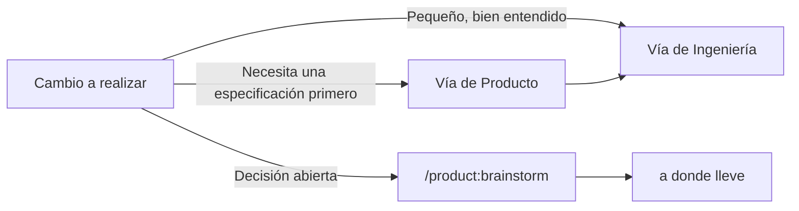
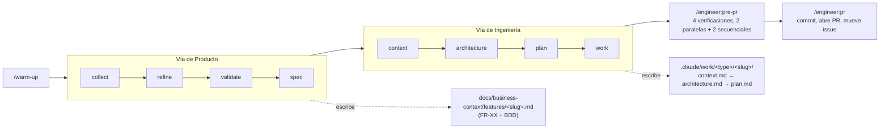
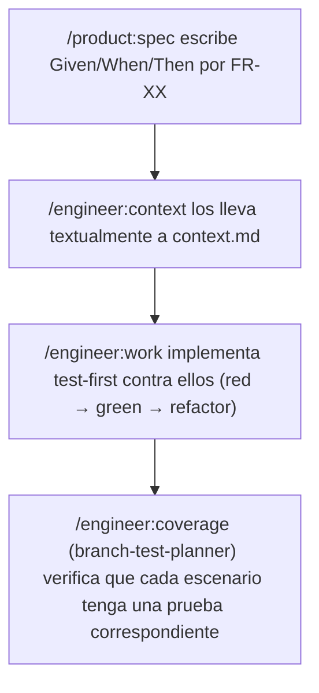
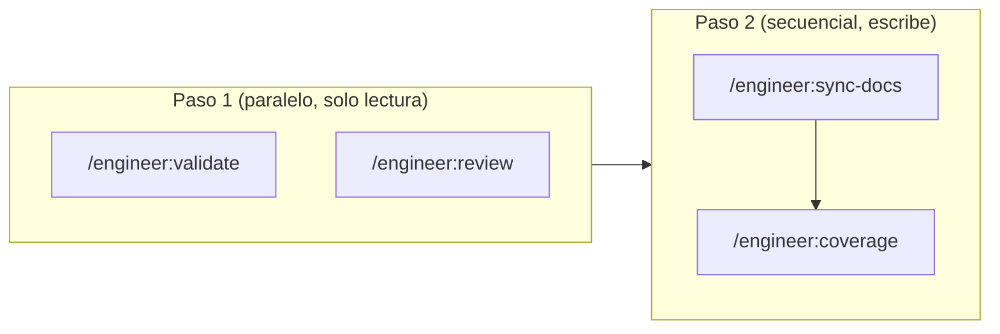

# CoDriDe

<div align="center">
  
  <br/><br/>


**Context Driven Development para Claude Code**

[English](./README.md) | [Português (Brasil)](./README_PT-BR.md) | Español

Un pipeline estructurado — master docs, GitHub Issues y 8 agentes enfocados — que lleva un proyecto desde una idea sin pulir hasta un PR fusionado.

**Ventajas principales:** Master Docs como Fuente de Verdad • Nativo de GitHub • Cero Lock-in Más Allá de `gh`

</div>

---

## 📖 Descripción General del Proyecto

### ¿Qué es esto?

CoDriDe es un framework de Context Driven Development (CDD) para Claude Code: un conjunto de comandos y agentes (que viven bajo `.claude/`) que estructuran cómo un proyecto pasa de una idea sin pulir a un PR fusionado — con una fuente de verdad persistente y versionada (**master docs**) contra la que se valida cada feature, y **GitHub Issues** como sistema de registro para la gestión del proyecto.

Este repositorio *es* el framework: aquí no hay código de aplicación. Copias `.claude/` (y `CLAUDE.md`) al proyecto que realmente quieres construir, y los comandos de CoDriDe quedan disponibles ahí.

### ¿Qué problemas resuelve?

- **Contexto que se evapora entre sesiones**: cada feature vuelve a derivar "cómo construimos las cosas aquí" desde cero, y no hay nada contra qué verificar un cambio salvo la memoria de un revisor.
- **Ninguna fuente de verdad contra la cual verificar un cambio**: sin master docs, "esto coincide con nuestra arquitectura" es una suposición, no una verificación.
- **Código generado por IA que se aleja de las convenciones reales**: la implementación ocurre sin nunca leer las ADR o los patrones que ya decidieron cómo debía construirse esto.

### Casos de Uso

- 🚀 Estructurar un proyecto completamente nuevo desde el día uno, con master docs vivos desde el inicio
- 🔧 Llevar un pipeline disciplinado de producto → ingeniería a una base de código existente
- 🧪 Desarrollo de features guiado por BDD/TDD, donde los criterios de aceptación sobreviven de la especificación a la prueba
- 📐 Diseño de arquitectura consciente de DDD para las features cuyo dominio es lo bastante complejo como para justificarlo
- 🗂️ Mantener las GitHub Issues honestas — sincronizadas desde los mismos docs de feature que especificaron el trabajo

---

## ⚡ Inicio Rápido

### Prerrequisitos

- [Claude Code](https://docs.anthropic.com/en/docs/claude-code)
- [CLI de `gh`](https://cli.github.com/), instalada y autenticada (`gh auth status`)
- Git

### Configuración en 5 Pasos

**Paso 1: Obtén el framework**
```bash
git clone https://github.com/edilson-silva/codride.git
```

**Paso 2: Cópialo en tu proyecto**
```bash
cp -r codride/.claude codride/CLAUDE.md /path/to/your-project/
cd /path/to/your-project
```

**Paso 3: Ejecuta la verificación de estado**
```bash
claude "/engineer:doctor"
```

**Paso 4: Escanea la base de código (opcional, pero afina todo lo demás)**
```bash
claude "/engineer:discover"
```

**Paso 5: Calienta la sesión y comienza**
```bash
claude "/warm-up"
```

### Ejemplo de Primera Feature

```bash
claude "/product:collect Los usuarios no pueden restablecer su contraseña si su email tiene un plus-alias"
# → crea un issue de GitHub

claude "/product:spec 42"
# → lo expande a un PRD completo con criterios de aceptación BDD

claude "/engineer:context fix/password-reset-plus-alias"
# → entrevista → context.md

claude "/engineer:architecture fix/password-reset-plus-alias"
# → diseño → architecture.md, verificado contra context.md

claude "/engineer:plan fix/password-reset-plus-alias"
claude "/engineer:work .claude/work/fix/password-reset-plus-alias"
claude "/engineer:pre-pr"
claude "/engineer:pr"
```

No necesitas todas las piezas desde el primer día — `/engineer:context` y `/engineer:architecture` funcionan bien sin master docs ni un briefing de descubrimiento; simplemente tienen menos contexto del que valerse.

### Incorporando CoDriDe en un Proyecto Existente

La configuración en 5 pasos de arriba funciona para cualquier proyecto, pero una base de código existente ya tiene señales valiosas para extraer — código, README, issues, ADRs — así que los comandos de bootstrap, por defecto, analizan ese material primero y solo entrevistan para llenar los vacíos. Este es el **modo Analysis**; un proyecto nuevo/vacío ejecuta en cambio el **modo Collection**, una entrevista desde cero (ver el [FAQ](#-preguntas-frecuentes)).

**Pasos 1-3: iguales a la configuración en 5 pasos** — copia `.claude/`, ejecuta `/engineer:doctor`, ejecuta `/engineer:discover`.

`/engineer:discover` es la pasada rápida y automática sobre la base de código: sin entrevista, seguro de volver a ejecutar incrementalmente a medida que el código evoluciona. Escribe:
- `docs/technical-context/project-briefing.md` — índice maestro + resumen
- `docs/technical-context/briefing/critical-rules.md` — las 3-5 reglas más críticas, copiadas por completo en cada futuro `context.md`
- `docs/technical-context/briefing/adrs-summary.md` — resúmenes indexados de ADRs (creado con una nota "ninguno todavía" si el proyecto no tiene ADRs)
- `docs/technical-context/briefing/backend-conventions.md` — estructura de carpetas, nomenclatura, patrones de código
- `docs/technical-context/briefing/tech-stack.md` — runtime, framework, base de datos/ORM, bibliotecas clave

También ejecuta `adr-compliance-checker` contra el código existente en cuanto los ADR de arriba están catalogados — eso se reporta directamente en la salida del comando, no se escribe en un archivo.

**Paso 4 (opcional, más profundo): el master doc técnico completo**
```bash
claude "/bootstrap:tech-docs [enlaces al repo/docs, si los hay]"
```
Más pesado que `/engineer:discover` — te entrevista (~10 preguntas) sobre decisiones de arquitectura, flujos de trabajo y desafíos conocidos, y luego escribe la arquitectura técnica completa:
- `docs/technical-context/index.md` — índice maestro
- `docs/technical-context/project_charter.md` — visión, criterios de éxito, alcance, stakeholders
- `docs/technical-context/adr/` — borradores de ADRs para decisiones que encontró en el código pero que nunca se documentaron
- `docs/technical-context/CLAUDE.meta.md` — guía de desarrollo para IA (estilo de código, trampas, patrones)
- `docs/technical-context/CODEBASE_GUIDE.md` — estructura de directorios anotada, flujo de datos, integraciones
- `docs/technical-context/BUSINESS_LOGIC.md` — reglas y flujos de dominio (si existe lógica de dominio compleja)
- `docs/technical-context/API_SPECIFICATION.md` — endpoints, autenticación, modelos de datos (si existen APIs)
- `docs/technical-context/CONTRIBUTING.md` — estrategia de ramas, proceso de revisión, requisitos de prueba
- `docs/technical-context/TROUBLESHOOTING.md` — problemas comunes y enfoques de depuración
- `docs/technical-context/ARCHITECTURE_CHALLENGES.md` — puntos de dolor conocidos y qué quiere mejorar el equipo

Ejecuta solo `/engineer:discover` si solo quieres que `context.md` tenga algo de qué valerse rápidamente; ejecuta `/bootstrap:tech-docs` cuando quieras el documento de "ADN" completo por escrito. Ejecutar ambos está bien — `/engineer:doctor` reporta ambos formatos presentes, no lo trata como un conflicto.

**Paso 5: el lado de negocio**
```bash
claude "/bootstrap:business-docs [enlaces a docs/tickets del producto, si los hay]"
```
Con material existente para extraer (un README con una descripción real del producto, issues de GitHub, páginas de marketing), esto se ejecuta en modo Analysis: investiga el producto, el mercado y los clientes, hace una ronda de preguntas de aclaración, y luego escribe:
- `docs/business-context/index.md` — índice maestro
- `docs/business-context/CUSTOMER_PERSONAS.md`
- `docs/business-context/CUSTOMER_JOURNEY.md`
- `docs/business-context/VOICE_OF_CUSTOMER.md`
- `docs/business-context/PRODUCT_STRATEGY.md`
- `docs/business-context/features/` — un archivo por cada feature existente
- `docs/business-context/PRODUCT_METRICS.md`
- `docs/business-context/COMPETITIVE_LANDSCAPE.md`
- `docs/business-context/INDUSTRY_TRENDS.md`
- `docs/business-context/SALES_PROCESS.md` (si aplica)
- `docs/business-context/MESSAGING_FRAMEWORK.md`
- `docs/business-context/CUSTOMER_COMMUNICATION.md`

Si un proyecto "existente" resulta tener poco o nada que extraer (un esqueleto vacío, una idea previa al lanzamiento), ambos comandos de bootstrap caen automáticamente al modo Collection — igual que un proyecto nuevo.

**Paso 6: calienta la sesión y comienza el pipeline**
```bash
claude "/warm-up"
```
De aquí en adelante, CoDriDe trata un proyecto existente exactamente igual que uno nuevo — `/product:collect`, `/engineer:context` y el resto del pipeline usan los master docs recién generados.

---

## 💡 Conceptos Centrales

### Context Driven Development

> **Antes confiábamos en la memoria de un revisor. Ahora confiamos en los master docs — y verificamos cada feature contra ellos, antes de construirla y de nuevo antes de lanzarla.**

CoDriDe trata dos artefactos como fundamentales:

1. **Los master docs son el ADN del proyecto.** Un pequeño conjunto de documentos vivos (contexto de negocio + contexto técnico) captura las decisiones que importan — estrategia de producto, personas, ADR, convenciones. Cada feature se verifica contra ellos antes de construirse (`/product:validate`) y de nuevo antes de lanzarse (`/engineer:validate`, parte de `/engineer:pre-pr`).
2. **Cada unidad de trabajo deja un rastro.** `/engineer:context` y `/engineer:architecture` escriben `context.md` y `architecture.md`, y `/engineer:plan` escribe un `plan.md` por fases, dentro de `.claude/work/<type>/<slug>/` — y esto no es solo para features. `<type>` sigue [Conventional Commits](https://www.conventionalcommits.org/) (`feat`, `fix`, `docs`, `chore`, `refactor`, `test`, `perf`, `build`, `ci`, `style`, `revert`), así que el elemento de trabajo de una corrección de bug vive en `.claude/work/fix/<slug>/`, coincidiendo con el nombre de la rama. Si el trabajo se interrumpe — un chat nuevo, un día diferente, otro ingeniero — la siguiente persona lee sus archivos y sabe exactamente dónde quedaron las cosas.

La gestión del proyecto pasa íntegramente por **GitHub Issues** vía la CLI de `gh` — sin una herramienta de PM separada que mantener sincronizada a mano.

### Enrutamiento: Vía de Producto vs. Vía de Ingeniería

CoDriDe no detecta la complejidad automáticamente — tú eliges el punto de entrada, y esa elección es barata de "equivocar" porque ambas vías son solo comandos:



Una feature típicamente fluye **de izquierda a derecha**: una idea se recolecta y refina del lado de producto, y luego se pasa al lado de ingeniería una vez que hay una especificación clara contra la cual construir.

### Modelo de Colaboración de Agentes

| Agente | Responsabilidad | Condición de Activación |
|---|---|---|
| `branch-master-docs-checker` | Verifica la rama contra los master docs | `/engineer:validate` (independiente o vía `/engineer:pre-pr`) |
| `branch-code-reviewer` | Calidad de código, bugs, seguridad, auditoría de dependencias | `/engineer:review` |
| `branch-documentation-writer` | Mantiene la documentación orientada al usuario (README, referencia de API, ejemplos de uso) sincronizada con los cambios de código | `/engineer:sync-docs` |
| `branch-test-planner` | Encuentra cobertura de pruebas faltante, incluyendo huecos de escenarios BDD | `/engineer:coverage` |
| `adr-compliance-checker` | Valida el código contra las ADR del proyecto | `/engineer:discover`, `/engineer:work` |
| `github-project-sync` | Sincroniza los docs de features con las GitHub Issues | `/product:sync-github` |
| `python-developer` | Implementación idiomática en Python | Bajo demanda, trabajo no trivial en Python |
| `typescript-developer` | Implementación idiomática en TypeScript/JavaScript | Bajo demanda, trabajo no trivial en TS/JS |

Estos 8 son el núcleo portable de CoDriDe — nombres sin prefijo. Cualquier cosa creada vía `/meta:create-agent` es específica del proyecto y recibe un prefijo `project-` en su lugar (ver [Configuración Avanzada](#️-configuración-avanzada)) — ese prefijo es lo único que distingue a los dos, ya que `.claude/agents/` no admite subdirectorios.

---

## 📋 Referencia de Comandos

Los comandos se invocan como `/<carpeta>:<archivo>`, p. ej. `.claude/commands/product/spec.md` → `/product:spec`. `/warm-up` vive en el nivel raíz, así que es solo `/warm-up`.

<details>
<summary><strong>Configuración</strong> — <code>/warm-up</code>, <code>/engineer:doctor</code>, <code>/engineer:discover</code></summary>

#### `/warm-up`
Carga las dos mitades de los master docs — producto (`docs/business-context/`) e ingeniería (`docs/technical-context/`) — más el `README.md` raíz, para que la sesión comience con el contexto correcto cargado. Solo lee los archivos índice/punto de entrada, no todo lo que señalan. Si alguna pieza aún no existe, lo indica y continúa.

- **Uso**: `/warm-up` (el nombre del proyecto es opcional, solo útil en un espacio de trabajo multi-proyecto)
- **Consejos**: ejecútalo al inicio de cualquier sesión donde vayas a tocar decisiones de producto o arquitectura. Sáltalo para una corrección de una sola línea.

#### `/engineer:doctor`
Una verificación de estado previa al vuelo, no un comando de corrección: reporta el estado de autenticación de `gh`, la rama predeterminada real del repositorio, si existe una suite de pruebas, el estado de los master docs, la taxonomía de etiquetas de GitHub, y si el repositorio es un monorepo — todo en una sola pasada, sin cambiar nada.

- **Uso**: `/engineer:doctor`
- **Consejos**: ejecútalo justo después de copiar `.claude/` en un proyecto, ya sea nuevo o con años de historia — en un repositorio existente es lo que revela "esto no es `main`, es `develop`" o "no hay suite de pruebas" antes de que esas suposiciones rompan un comando a mitad del pipeline en lugar de al principio.

#### `/engineer:discover`
Escanea la base de código una vez (o de forma incremental) y escribe `docs/technical-context/project-briefing.md` más `docs/technical-context/briefing/{critical-rules,adrs-summary,backend-conventions,tech-stack}.md`. Detecta ADR, infiere convenciones arquitectónicas, e identifica el stack a partir del archivo de manifiesto — luego ejecuta `adr-compliance-checker` contra la base de código existente, así que adoptar CoDriDe en un proyecto ya existente muestra de inmediato dónde el código se desvió de sus propias decisiones documentadas.

- **Uso**: `/engineer:discover`, o `/engineer:discover --verbose` para una ejecución detallada
- **Consejos**: escribe tus ADR *antes* de ejecutar esto si puedes — cuantas más decisiones estén documentadas, más tendrá `adr-compliance-checker` para verificar, tanto aquí como más tarde durante `/engineer:work`.

</details>

<details>
<summary><strong>Inicialización de master docs</strong> — <code>/bootstrap:*</code></summary>

Genera la arquitectura de master docs multi-archivo desde cero. Úsalo una vez por proyecto, y luego mantenlo a mano (o vía `/engineer:sync-docs`).

#### `/bootstrap:tech-docs`
Genera la arquitectura completa de contexto técnico (carta del proyecto, ADR, guía de desarrollo para IA, navegación de la base de código, lógica de negocio, especificación de API, guía de contribución, resolución de problemas) bajo `docs/technical-context/`. Analiza la base de código local por sí solo — los argumentos son opcionales, solo necesarios para apuntarlo a material fuera de este repo.

- **Uso**: `/bootstrap:tech-docs`, o `/bootstrap:tech-docs <enlaces a repos/archivos a analizar>` para incluir material externo

#### `/bootstrap:business-docs`
Genera la arquitectura completa de contexto de negocio (personas, journey, voz del cliente, estrategia de producto, catálogo de features, panorama competitivo, guías de ventas/mensajería) bajo `docs/business-context/`. Funciona de dos maneras: el **modo análisis** extrae información del material que le indiques; el **modo recolección** realiza una entrevista al fundador/PM en su lugar, para un proyecto nuevo sin nada que analizar todavía.

- **Uso**: `/bootstrap:business-docs <enlaces a docs de producto, tickets de soporte, PRD existentes, etc.>`, o sin argumentos para el modo recolección.
- **Consejos**: en modo recolección, todo lo generado se marca explícitamente como una hipótesis no validada — vuelve a ejecutarlo (o usa `/product:brainstorm`) una vez que clientes reales confirmen o revisen esas suposiciones.

#### `/bootstrap:index`
Construye o actualiza un `index.md` que apunta a cada archivo de documentación útil. Detecta si esto es un proyecto único o un meta-repositorio de docs multi-proyecto, y se adapta en consecuencia.

- **Uso**: `/bootstrap:index` o `/bootstrap:index <nombre-del-proyecto>` (modo meta-repositorio)

</details>

<details open>
<summary><strong>Vía de producto</strong> — <code>/product:*</code></summary>

#### `/product:collect`
Captura una idea sin pulir o un reporte de bug como un issue de GitHub, con la claridad justa para recordarlo después — sin especificación completa todavía.

- **Uso**: `/product:collect "los usuarios no pueden restablecer su contraseña si su email tiene un plus-alias"`

#### `/product:refine`
Convierte un requisito recolectado en un documento estructurado de POR QUÉ / QUÉ / CÓMO, mediante un diálogo de preguntas aclaratorias.

- **Uso**: `/product:refine 42` (un número de issue de GitHub) o `/product:refine <ruta/al/archivo.md>`

#### `/product:validate`
Valida una o más features descritas contra los master docs del proyecto, reportando qué está alineado y qué contradice un master doc específico (con cita).

- **Uso**: `/product:validate "agregar inicio de sesión social vía Google y GitHub"`
- **Consejos**: no confundir con `/engineer:validate`, que verifica la *rama* después del hecho — este verifica la *idea*, antes de que se construya nada.

#### `/product:spec`
Expande un requisito validado en un PRD completo: descripción general del producto, requisitos funcionales (numerados `FR-01`, `FR-02`, ...) con criterios de aceptación BDD, requisitos no funcionales, consideraciones de UX y técnicas, riesgos, restricciones. También guarda `docs/business-context/features/<slug>.md` en el formato que `/product:sync-github` espera.

- **Uso**: `/product:spec 42`

#### `/product:brainstorm`
Una sesión de brainstorming estructurada y deliberadamente adversarial para decisiones abiertas de producto o negocio — genera alternativas reales, matrices de compensación y riesgo, y una recomendación fundamentada, y luego se detiene para revisión humana.

- **Uso**: `/product:brainstorm "¿deberíamos construir una app nativa o invertir en la PWA?"`
- **Consejos**: es el comando más pesado del framework — resérvalo para decisiones con alternativas reales que vale la pena sopesar.

#### `/product:quick-spec`
Crea un issue de GitHub ya completamente especificado directamente desde una descripción de tarea, sin el diálogo de varios pasos de recolectar → refinar → especificar.

- **Uso**: `/product:quick-spec "agregar límite de tasa a la API pública, 100 solicitudes/min por API key"`

#### `/product:sync-github`
Mantiene `docs/business-context/features/*.md` sincronizado con las GitHub Issues de este repositorio — crea issues faltantes, actualiza los que se desalinearon, marca huérfanos. Siempre muestra una vista previa del diff antes de escribir nada.

- **Uso**: `/product:sync-github`, `/product:sync-github module=Billing`, o `/product:sync-github preview`

</details>

<details open>
<summary><strong>Vía de ingeniería</strong> — <code>/engineer:*</code></summary>

#### `/engineer:context`
Inicia una unidad de trabajo: una entrevista para construir un entendimiento compartido, escrita en `context.md`. Primero de un par de dos pasos con `/engineer:architecture`.

- **Uso**: `/engineer:context feat/csv-order-export` — el argumento es `<type>/<slug>`

#### `/engineer:architecture`
Lee `context.md` y diseña la implementación, escrita en `architecture.md`, con una verificación de consistencia obligatoria entre ambos documentos antes de que apruebes.

- **Uso**: `/engineer:architecture feat/csv-order-export`

#### `/engineer:plan`
Convierte `context.md` + `architecture.md` en un `plan.md` por fases, cada fase dimensionada para aproximadamente 2 horas de trabajo humano, reanudable si se interrumpe.

- **Uso**: `/engineer:plan feat/csv-order-export`

#### `/engineer:work`
Ejecuta la siguiente fase de `plan.md`, mantiene la etiqueta de estado del issue de GitHub sincronizada en tiempo real, e implementa test-first contra cualquier criterio de aceptación BDD.

- **Uso**: `/engineer:work .claude/work/feat/csv-order-export`

#### `/engineer:pre-pr`
Un orquestador, no una verificación en sí misma: ejecuta `/engineer:validate` y `/engineer:review` en paralelo, luego `/engineer:sync-docs` y `/engineer:coverage` secuencialmente — y te ayuda a actuar sobre su retroalimentación combinada.

- **Uso**: `/engineer:pre-pr`

#### `/engineer:validate` / `/engineer:review` / `/engineer:sync-docs` / `/engineer:coverage`
Atajos de una línea que invocan directamente `branch-master-docs-checker` / `branch-code-reviewer` / `branch-documentation-writer` / `branch-test-planner` — cada uno también se ejecuta de forma independiente, sin el barrido completo de `/engineer:pre-pr`. Nota la diferencia: `/engineer:validate` verifica la branch contra los master docs internos (contexto de negocio/técnico, el "ADN" del proyecto); `/engineer:sync-docs` actualiza la documentación externa, orientada al usuario — README, referencia de API, ejemplos de uso, guías de instalación/configuración — todo lo que otro desarrollador o equipo leería para entender o integrar el proyecto.

- **Consejos**: ejecuta `/engineer:coverage` justo después de una fase mientras el código está fresco; ejecuta `/engineer:review` a mitad de la feature, no solo antes de un PR.

#### `/engineer:pr`
Ejecuta las pruebas, hace commit, abre el PR, mueve el issue de GitHub a "en revisión", y evalúa contigo los comentarios automáticos de revisión de código.

- **Uso**: `/engineer:pr`

#### `/engineer:bump`
Incrementa la versión semver del proyecto, detectando si el proyecto usa `pyproject.toml`, `package.json`, o ambos.

- **Uso**: `/engineer:bump`

#### `/engineer:adr`
Redacta un nuevo Architecture Decision Record bajo `docs/technical-context/adr/`, verificando primero conflictos con o sustitución de ADR existentes.

- **Uso**: `/engineer:adr "usar event sourcing para el agregado de pedidos"`

</details>

<details>
<summary><strong>Meta</strong> — <code>/meta:create-agent</code></summary>

#### `/meta:create-agent`
Crea un nuevo subagente bajo `.claude/agents/`, nombrado `project-<name>.md` por defecto (ver [Configuración Avanzada](#️-configuración-avanzada)).

- **Uso**: `/meta:create-agent "un agente que audita nuestro esquema GraphQL en busca de cambios incompatibles antes del merge"` → crea `project-graphql-schema-auditor.md`

</details>

---

## 📚 Guía de Uso

### Estructura de Directorios

```
docs/
├── business-context/           # master docs: estrategia, personas, catálogo de features
│   ├── index.md                 # punto de entrada, generado por /bootstrap:business-docs
│   ├── features/                 # un .md por feature — /product:spec o /product:quick-spec lo escribe,
│   │                             #   /product:sync-github lo mantiene sincronizado con las GitHub Issues
│   └── brainstorm/               # salida de sesión de /product:brainstorm
└── technical-context/          # la forma depende de qué comando la generó:
    ├── project-briefing.md      #   /engineer:discover  → briefing compacto (+ briefing/*.md abajo)
    ├── briefing/                 #   critical-rules, adrs-summary, backend-conventions, tech-stack
    ├── index.md                 #   /bootstrap:tech-docs → punto de entrada al conjunto completo abajo
    ├── adr/                      # Architecture Decision Records
    └── project_charter.md, CODEBASE_GUIDE.md, BUSINESS_LOGIC.md, API_SPECIFICATION.md, ...

.claude/
├── agents/                          # los 8 agentes de arriba (+ project-*.md que agregues)
├── commands/                        # engineer/, product/, bootstrap/, meta/, warm-up.md
├── work/<type>/<slug>/               # context.md, architecture.md, plan.md por elemento de trabajo en curso
│   ├── feat/csv-order-export/        # p. ej. una feature
│   └── fix/password-reset-plus-alias/ # p. ej. una corrección de bug
└── rules/product-agent.mdc          # persona de PM/arquitecto siempre activa
```

`docs/technical-context/` normalmente tiene solo una de las dos formas mostradas, no ambas. El `<type>` en `.claude/work/` y en los nombres de rama sigue [Conventional Commits](https://www.conventionalcommits.org/) (`feat`, `fix`, `docs`, `chore`, `refactor`, `test`, `perf`, `build`, `ci`, `style`, `revert`).

### Escribir un Archivo de Feature

`docs/business-context/features/<slug>.md` — el formato que `/product:spec` escribe y `/product:sync-github` lee:

````markdown
# [Título de la Feature]

**Status**: Planned
**Priority**: High
**Scope**: MVP

[Descripción general del producto en 1-2 párrafos]

### FR-01: [Título del requisito]
[Descripción]

**Criterios de aceptación:**
```
Given ...
When ...
Then ...
```
````

### Configuración: MCP Opcionales

El ciclo central de CoDriDe no necesita nada más que `gh` — no se requiere ningún servidor MCP. Vale la pena agregar dos por sus beneficios reales y específicos:

- **[Context7](https://github.com/upstash/context7)** — búsqueda de documentación actualizada de bibliotecas/frameworks, ajustada a la versión realmente en uso. Conectado directamente en las listas de herramientas de `python-developer` y `typescript-developer`; primero verifican la versión real de la dependencia, luego usan Context7 si está configurado, o `WebSearch` si no lo está.
- **Un MCP de Playwright** (p. ej. [`@playwright/mcp`](https://github.com/microsoft/playwright-mcp)) — cierra el ciclo de los criterios de aceptación BDD dejando que un agente realmente maneje un navegador a través de un escenario `Given/When/Then`. Solo relevante para proyectos con interfaz web.

### Buenas Prácticas

#### ✅ Prácticas Recomendadas
- Deja que `/engineer:context`, `/engineer:architecture`, `/engineer:plan` y `/product:brainstorm` se detengan en sus puntos de control — no fuerces el paso solo porque la respuesta parezca obvia.
- Ejecuta `/engineer:discover` con anticipación, no a mitad de una feature, para que `/engineer:context` tenga un briefing listo para cargar de forma selectiva.
- Trata un conflicto de `/product:validate` o de `branch-master-docs-checker` como una señal real para detenerse y discutir, no como ruido que ignorar.
- Extiende el conjunto de agentes con `/meta:create-agent` para cualquier cosa específica del proyecto o del stack — antepone `project-*` automáticamente.
- Ejecuta `/engineer:review` y `/engineer:coverage` a mitad de la feature, no solo al momento de `/engineer:pre-pr` — detectar un problema antes sale más barato.

#### ❌ Cosas a Evitar
- Ejecutar todo el pipeline de producto → ingeniería para una corrección de una línea (ve directo a una rama + `/engineer:pre-pr`).
- Saltarte la verificación de consistencia cruzada que `/engineer:architecture` ejecuta entre `context.md` y `architecture.md`.
- Editar directamente uno de los 8 agentes del framework en lugar de agregar uno `project-*`.
- Gestionar un token de GitHub separado o un servidor MCP para el seguimiento de issues — `gh auth status` es la única credencial que este framework necesita.
- Dejar `docs/business-context/features/` vacío y esperar que `/product:sync-github` tenga algo que sincronizar.

---

## 🏗️ Diseño de la Arquitectura

### Diagrama del Pipeline



### El Ciclo BDD → TDD → Coverage

Los criterios de aceptación se escriben una vez y se consumen tres veces, sin volver a escribirlos:



### Orden de Ejecución de `/engineer:pre-pr`



Validate y review no dependen de la salida del otro y no tocan nada en disco, así que se ejecutan de forma concurrente. Sync-docs y coverage ambos escriben, así que se ejecutan uno después del otro, tras terminar el par de solo lectura.

### Verificaciones de Consistencia

- **`context.md` ↔ `architecture.md`**: `/engineer:architecture` ejecuta una verificación cruzada obligatoria antes de que apruebes — detecta "context.md dice modificar X, architecture.md dice eliminar X" antes de que se convierta en un bug real.
- **Rama ↔ master docs**: `branch-master-docs-checker` (`/engineer:validate`) verifica los cambios reales de la rama contra los master docs, independientemente de lo planeado.
- **ADR ↔ código**: `adr-compliance-checker` se ejecuta durante `/engineer:discover` y `/engineer:work`, en modo consultivo por defecto — sugiere correcciones en lugar de bloquear, a menos que un proyecto configure explícitamente una regla como estricta.

---

## ⚙️ Configuración Avanzada

### Agentes Personalizados

Extiende CoDriDe con agentes específicos del proyecto o del stack vía `/meta:create-agent` (un especialista en NestJS, un revisor de Terraform, lo que tu proyecto necesite) — nunca edites directamente los 8 agentes del framework.

`.claude/agents/` es un espacio de nombres plano (Claude Code no descubre agentes en subdirectorios), así que el nombrado hace el trabajo que haría una carpeta: cada agente que crea `/meta:create-agent` se llama `project-<name>.md` por defecto (p. ej. `project-notion-specialist.md`). Dale una descripción en lenguaje natural — en cualquier idioma — y él mismo normaliza el nombre (traduce → condensa a 2-4 palabras → kebab-case → prefijo).

```markdown
---
name: project-[nombre-del-agente]
description: [descripción clara del propósito del agente]
tools: [lista mínima de herramientas — Read/Glob/Grep/Bash para un verificador, agrega Write/Edit solo si modifica archivos]
---

[Prompt del sistema: rol, proceso paso a paso, restricciones, formato de salida]
```

### Comandos de Extensión

Agrega comandos personalizados bajo `.claude/commands/<namespace>/<comando>.md` — la carpeta se convierte en el namespace (`.claude/commands/product/spec.md` → `/product:spec`).

```markdown
---
description: [descripción de una línea mostrada en el selector de /]
argument-hint: [<obligatorio> o [opcional] — coincidiendo con el estilo de corchetes]
---

[Instrucciones de lo que hace este comando, paso a paso]

#$ARGUMENTS
```

### Archivo de Configuración

`.claude/settings.local.json` guarda permisos locales de la máquina (qué llamadas de `Bash`/`WebSearch` ya están preaprobadas) — está en `.gitignore` por convención, no está pensado para compartirse. Mantenlo mínimo (`git *`, `gh *` cubren casi todo lo que este framework necesita).

---

## 📖 Ejemplos de Uso

### Ejemplo 1: Feature Completa, de Principio a Fin

```bash
claude "/product:collect los clientes quieren exportar su historial de pedidos como CSV"
# → crea el issue #42 de GitHub

claude "/product:refine 42"
# → issue #42 reescrito como POR QUÉ / QUÉ / CÓMO

claude "/product:validate exportación CSV del historial de pedidos, issue #42"
# → confirma que esto no viola ningún master doc

claude "/product:spec 42"
# → PRD completo con FR-01, FR-02... y criterios de aceptación Given/When/Then;
#   también escribe docs/business-context/features/csv-order-export.md

claude "/engineer:context feat/csv-order-export"
claude "/engineer:architecture feat/csv-order-export"
claude "/engineer:plan feat/csv-order-export"
claude "/engineer:work .claude/work/feat/csv-order-export"
# → implementa fase por fase, test-first contra los criterios de aceptación

claude "/engineer:pre-pr"
claude "/engineer:pr"
```

### Ejemplo 2: Tarea Bien Entendida, Vía Rápida

```bash
claude "/product:quick-spec agregar límite de tasa a la API pública, 100 solicitudes/min por API key"
# → issue de GitHub ya completamente especificado, sin necesidad de entrevista

claude "/engineer:context fix/api-rate-limiting"
claude "/engineer:architecture fix/api-rate-limiting"
claude "/engineer:plan fix/api-rate-limiting"
claude "/engineer:work .claude/work/fix/api-rate-limiting"
claude "/engineer:pre-pr"
claude "/engineer:pr"
```

---

## ❓ Preguntas Frecuentes

### P: ¿En qué se diferencia esto de simplemente usar Claude Code directamente?
R: Claude Code sin CoDriDe aún escribe buen código, pero cada sesión vuelve a derivar las convenciones del proyecto desde cero, y no hay nada duradero contra qué verificar un cambio. CoDriDe agrega master docs (una fuente de verdad persistente), una convención de elemento de trabajo `type/slug` (para que el trabajo interrumpido se reanude en lugar de reiniciar), y un conjunto fijo de verificaciones (`/engineer:pre-pr`) que se ejecutan de la misma manera cada vez.

### P: Mi proyecto todavía no tiene master docs — ¿puedo usar esto de todos modos?
R: Sí. `/engineer:context` y `/engineer:architecture` funcionan sin ellos; simplemente tienen menos contexto del que valerse. Ejecuta `/bootstrap:business-docs` y `/bootstrap:tech-docs` cuando estés listo — `/bootstrap:business-docs` incluso funciona sin nada que analizar todavía, mediante su modo de recolección guiado por entrevista.

### P: ¿Tengo que usar GitHub Issues?
R: El pipeline de producto/ingeniería está construido en torno a `gh`, y `github-project-sync` es uno de los 8 agentes centrales. Si tu proyecto usa otro sistema de seguimiento, necesitarías un agente `project-*` (vía `/meta:create-agent`) para reemplazar el rol de `github-project-sync` — el resto del pipeline (master docs, elementos de trabajo, ciclo BDD/TDD) no depende de GitHub específicamente.

### P: ¿Qué pasa si solo necesito una verificación de `/engineer:pre-pr`?
R: Ejecútala directamente — `/engineer:validate`, `/engineer:review`, `/engineer:sync-docs` y `/engineer:coverage` son todos comandos independientes. `/engineer:pre-pr` es un orquestador de conveniencia, no un requisito.

### P: ¿Cómo agrego soporte para un framework/lenguaje para el que CoDriDe no incluye un agente?
R: `/meta:create-agent` — describe lo que necesitas en lenguaje natural, propone un nombre con prefijo `project-*` y un conjunto mínimo de herramientas, y tú confirmas antes de que se cree.

---

## 🤝 Contribuir

Las contribuciones son bienvenidas — este framework mejora de la misma forma en que lo hace cualquier proyecto gestionado por CoDriDe: a través del propio pipeline.

### Cómo Contribuir

1. **Haz un fork del proyecto** y crea una rama nombrada `type/slug` (p. ej. `fix/adr-numbering`, `feat/rust-developer-agent`), siguiendo los tipos de [Conventional Commits](https://www.conventionalcommits.org/) que usan los propios elementos de trabajo de CoDriDe.
2. **Haz tu cambio** — si estás tocando `.claude/commands/` o `.claude/agents/`, mantén el tono existente (directo, sin relleno) y la convención de herramientas mínimas.
3. **Actualiza `README.md`/`CLAUDE.md`** si el cambio afecta el pipeline, la lista de comandos, o el conjunto de agentes — se espera que se mantengan precisos, no solo los archivos de comando en sí.
4. **Abre un PR** describiendo qué cambió y por qué.

### Flujo de Desarrollo

```bash
git clone https://github.com/your-username/codride.git
cd codride
git checkout -b feat/your-feature-name

# ... haz tus cambios ...

git add <archivos específicos>
git commit -m "add your feature description"
git push origin feat/your-feature-name
```

### Tipos de Contribución

- 🐛 **Correcciones**: referencias cruzadas rotas, nomenclatura inconsistente, documentación desactualizada
- ✨ **Nuevos agentes/comandos**: siguiendo las convenciones ya existentes de herramientas mínimas y responsabilidad única
- 📚 **Documentación**: aclarar vacíos, agregar ejemplos
- 🌐 **Cobertura de framework/lenguaje**: un agente implementador genérico (no atado a un stack) para un lenguaje que CoDriDe aún no cubre

---

## 📜 Licencia

Este proyecto es de código abierto bajo la [Licencia MIT](./LICENSE).

---

## 🙏 Agradecimientos

Construido sobre [Claude Code](https://docs.anthropic.com/en/docs/claude-code) de [Anthropic](https://www.anthropic.com/).

---

## 🔗 Enlaces Relacionados

- **Documentación de Claude Code**: [docs.anthropic.com/en/docs/claude-code](https://docs.anthropic.com/en/docs/claude-code)
- **Reporte de issues**: [GitHub Issues](https://github.com/edilson-silva/codride/issues)
- **Conventional Commits** (la convención `type/slug` detrás de los elementos de trabajo y las ramas): [conventionalcommits.org](https://www.conventionalcommits.org/)

---

<div align="center">

**Si CoDriDe te ayuda, por favor dale una ⭐️**

Hecho con ❤️ por [Edilson Silva](https://github.com/edilson-silva)

</div>
