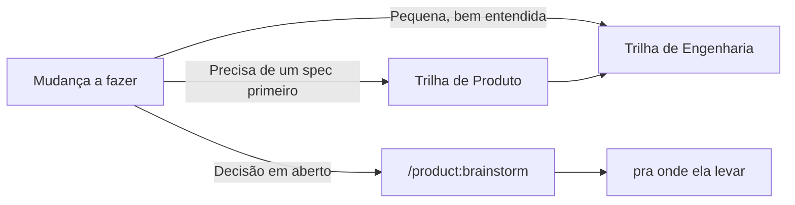
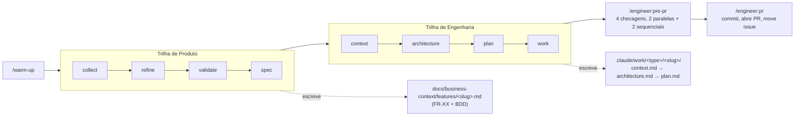
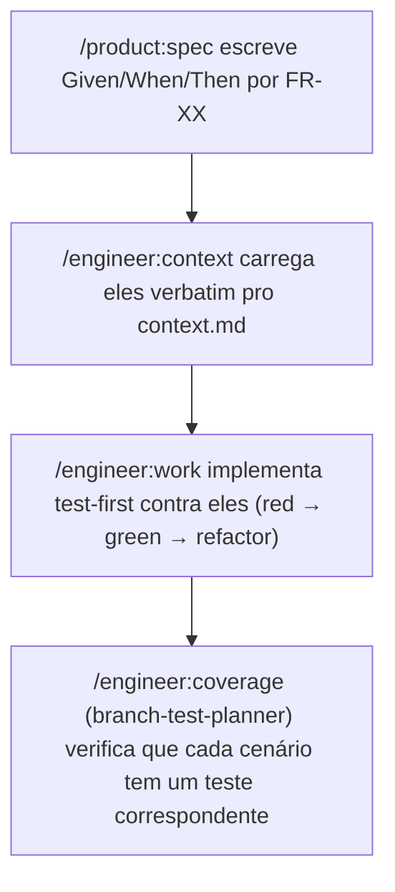
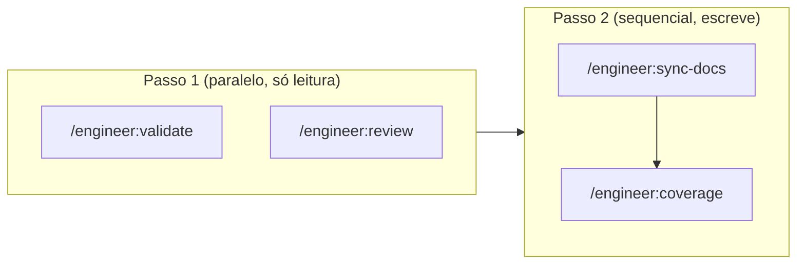

# CoDriDe

<div align="center">
  
  <br/><br/>


**Context Driven Development para o Claude Code**

[English](./README.md) | Português (Brasil) | [Español](./README_ES.md)

Um pipeline estruturado — master docs, GitHub Issues e 8 agentes focados — que leva um projeto de uma ideia crua a um PR mergeado.

**Vantagens principais:** Master Docs como Fonte da Verdade • Nativo do GitHub • Zero Lock-in Além do `gh`

</div>

---

## 📖 Visão Geral do Projeto

### O que é isso?

CoDriDe é um framework de Context Driven Development (CDD) para o Claude Code: um conjunto de comandos e agentes (vivendo sob `.claude/`) que estruturam como um projeto vai de uma ideia crua a um PR mergeado — com uma fonte da verdade persistente e versionada (**master docs**) contra a qual toda feature é checada, e **GitHub Issues** como o sistema de registro para gestão de projeto.

Este repositório *é* o framework: não há código de aplicação aqui. Você copia `.claude/` (e `CLAUDE.md`) para o projeto que você realmente quer construir, e os comandos do CoDriDe ficam disponíveis lá.

### Que problemas isso resolve?

- **Contexto que evapora entre sessões**: toda feature re-deriva "como construímos as coisas aqui" do zero, e não há nada pra checar uma mudança contra além da memória de um revisor.
- **Nenhuma fonte da verdade pra checar uma mudança**: sem master docs, "isso bate com nossa arquitetura" é um chute, não uma checagem.
- **Código gerado por IA que se afasta das convenções reais**: a implementação acontece sem nunca ler as ADRs ou os padrões que já decidiram como isso deveria ser construído.

### Casos de Uso

- 🚀 Estruturar um projeto novo desde o dia zero, com master docs vivos desde o início
- 🔧 Trazer um pipeline disciplinado de produto → engenharia pra uma base de código já existente
- 🧪 Desenvolvimento de features guiado por BDD/TDD, onde os critérios de aceite sobrevivem do spec ao teste
- 📐 Desenho de arquitetura ciente de DDD para as features cujo domínio é complexo o suficiente pra justificar
- 🗂️ Manter as GitHub Issues honestas — sincronizadas a partir dos mesmos docs de feature que especificaram o trabalho

---

## ⚡ Início Rápido

### Pré-requisitos

- [Claude Code](https://docs.anthropic.com/en/docs/claude-code)
- [`gh` CLI](https://cli.github.com/), instalado e autenticado (`gh auth status`)
- Git

### Configuração em 5 Passos

**Passo 1: Baixe o framework**
```bash
git clone https://github.com/edilson-silva/codride.git
```

**Passo 2: Copie para o seu projeto**
```bash
cp -r codride/.claude codride/CLAUDE.md /path/to/your-project/
cd /path/to/your-project
```

**Passo 3: Rode a checagem de saúde**
```bash
claude "/engineer:doctor"
```

**Passo 4: Escaneie a base de código (opcional, mas deixa tudo mais afiado)**
```bash
claude "/engineer:discover"
```

**Passo 5: Aqueça a sessão e comece**
```bash
claude "/warm-up"
```

### Exemplo de Primeira Feature

```bash
claude "/product:collect Usuários não conseguem redefinir a senha se o email tiver um plus-alias"
# → cria uma issue no GitHub

claude "/product:spec 42"
# → expande pra um PRD completo com critérios de aceite em BDD

claude "/engineer:context fix/password-reset-plus-alias"
# → entrevista → context.md

claude "/engineer:architecture fix/password-reset-plus-alias"
# → desenho → architecture.md, checado contra o context.md

claude "/engineer:plan fix/password-reset-plus-alias"
claude "/engineer:work .claude/work/fix/password-reset-plus-alias"
claude "/engineer:pre-pr"
claude "/engineer:pr"
```

Você não precisa de tudo isso no primeiro dia — `/engineer:context` e `/engineer:architecture` funcionam bem sem master docs ou um briefing de descoberta; eles só têm menos contexto pra usar.

### Adotando o CoDriDe em um Projeto Existente

A configuração em 5 passos acima funciona pra qualquer projeto, mas uma base de código existente já tem sinal valioso pra minerar — código, README, issues, ADRs — então os comandos de bootstrap, por padrão, analisam esse material primeiro e só fazem entrevista pra preencher as lacunas. Esse é o **modo Analysis**; um projeto novo/vazio roda o **modo Collection**, uma entrevista do zero (veja as [Perguntas Frequentes](#-perguntas-frequentes)).

**Passos 1-3: iguais à configuração em 5 passos** — copie o `.claude/`, rode o `/engineer:doctor`, rode o `/engineer:discover`.

O `/engineer:discover` é a passada rápida e automática pela base de código: sem entrevista, seguro pra rodar de novo incrementalmente conforme o código evolui. Ele escreve:
- `docs/technical-context/project-briefing.md` — índice mestre + resumo
- `docs/technical-context/briefing/critical-rules.md` — as 3-5 regras mais críticas, copiadas por completo em todo `context.md` futuro
- `docs/technical-context/briefing/adrs-summary.md` — resumos indexados de ADRs (criado com uma nota "nenhum ainda" se o projeto não tiver ADRs)
- `docs/technical-context/briefing/backend-conventions.md` — estrutura de pastas, nomenclatura, padrões de código
- `docs/technical-context/briefing/tech-stack.md` — runtime, framework, banco de dados/ORM, bibliotecas-chave

Ele também roda o `adr-compliance-checker` contra o código existente assim que os ADRs acima são catalogados — isso é reportado direto na saída do comando, não escrito em arquivo.

**Passo 4 (opcional, mais profundo): o master doc técnico completo**
```bash
claude "/bootstrap:tech-docs [links pro repo/docs, se houver]"
```
Mais pesado que o `/engineer:discover` — ele te entrevista (~10 perguntas) sobre decisões de arquitetura, fluxos de trabalho e desafios conhecidos, e então escreve a arquitetura técnica completa:
- `docs/technical-context/index.md` — índice mestre
- `docs/technical-context/project_charter.md` — visão, critérios de sucesso, escopo, stakeholders
- `docs/technical-context/adr/` — rascunhos de ADRs pras decisões que ele encontrou no código mas que nunca foram registradas
- `docs/technical-context/CLAUDE.meta.md` — guia de desenvolvimento pra IA (estilo de código, pegadinhas, padrões)
- `docs/technical-context/CODEBASE_GUIDE.md` — estrutura de diretórios anotada, fluxo de dados, integrações
- `docs/technical-context/BUSINESS_LOGIC.md` — regras e fluxos de domínio (se houver lógica de domínio complexa)
- `docs/technical-context/API_SPECIFICATION.md` — endpoints, autenticação, modelos de dados (se houver APIs)
- `docs/technical-context/CONTRIBUTING.md` — estratégia de branch, processo de review, requisitos de teste
- `docs/technical-context/TROUBLESHOOTING.md` — problemas comuns e abordagens de debug
- `docs/technical-context/ARCHITECTURE_CHALLENGES.md` — pontos de dor conhecidos e o que o time quer melhorar

Rode só o `/engineer:discover` se você só quer que o `context.md` tenha algo pra usar rapidamente; rode o `/bootstrap:tech-docs` quando quiser o documento de "DNA" completo registrado. Rodar os dois é normal — o `/engineer:doctor` reporta os dois formatos presentes, sem tratar isso como conflito.

**Passo 5: o lado de negócio**
```bash
claude "/bootstrap:business-docs [links pra docs/tickets do produto, se houver]"
```
Com material existente pra minerar (um README com descrição real do produto, issues no GitHub, páginas de marketing), isso roda em modo Analysis: pesquisa o produto, o mercado e os clientes, faz uma rodada de perguntas de esclarecimento, e então escreve:
- `docs/business-context/index.md` — índice mestre
- `docs/business-context/CUSTOMER_PERSONAS.md`
- `docs/business-context/CUSTOMER_JOURNEY.md`
- `docs/business-context/VOICE_OF_CUSTOMER.md`
- `docs/business-context/PRODUCT_STRATEGY.md`
- `docs/business-context/features/` — um arquivo por feature existente
- `docs/business-context/PRODUCT_METRICS.md`
- `docs/business-context/COMPETITIVE_LANDSCAPE.md`
- `docs/business-context/INDUSTRY_TRENDS.md`
- `docs/business-context/SALES_PROCESS.md` (se aplicável)
- `docs/business-context/MESSAGING_FRAMEWORK.md`
- `docs/business-context/CUSTOMER_COMMUNICATION.md`

Se um projeto "existente" acabar tendo pouco ou nada pra minerar (um esqueleto vazio, uma ideia pré-lançamento), os dois comandos de bootstrap caem automaticamente pro modo Collection — igual a um projeto novo.

**Passo 6: aqueça a sessão e comece o pipeline**
```bash
claude "/warm-up"
```
Daqui pra frente, o CoDriDe trata um projeto existente exatamente como um novo — `/product:collect`, `/engineer:context` e o resto do pipeline usam os master docs recém-gerados.

---

## 💡 Conceitos Centrais

### Context Driven Development

> **Antes a gente confiava na memória de um revisor. Agora a gente confia nos master docs — e checa toda feature contra eles, antes de ser construída e de novo antes de ir pra produção.**

O CoDriDe trata dois artefatos como estruturais:

1. **Master docs são o DNA do projeto.** Um pequeno conjunto de documentos vivos (contexto de negócio + contexto técnico) captura as decisões que importam — estratégia de produto, personas, ADRs, convenções. Toda feature é checada contra eles antes de ser construída (`/product:validate`) e de novo antes de ir pra produção (`/engineer:validate`, parte do `/engineer:pre-pr`).
2. **Toda unidade de trabalho deixa um rastro.** `/engineer:context` e `/engineer:architecture` escrevem `context.md` e `architecture.md`, e `/engineer:plan` escreve um `plan.md` faseado, dentro de `.claude/work/<type>/<slug>/` — e isso não é só pra features. `<type>` segue o [Conventional Commits](https://www.conventionalcommits.org/) (`feat`, `fix`, `docs`, `chore`, `refactor`, `test`, `perf`, `build`, `ci`, `style`, `revert`), então o item de trabalho de uma correção de bug vive em `.claude/work/fix/<slug>/`, batendo com o nome da branch. Se o trabalho for interrompido — um chat novo, um dia diferente, outro engenheiro — a próxima pessoa lê os arquivos e sabe exatamente onde as coisas pararam.

A gestão de projeto passa inteira pelas **GitHub Issues** via `gh` CLI — sem uma ferramenta de PM separada pra manter sincronizada manualmente.

### Roteamento: Trilha de Produto vs. Trilha de Engenharia

O CoDriDe não detecta complexidade automaticamente — você escolhe o ponto de entrada, e essa escolha é barata de "errar" porque as duas trilhas são só comandos:



Uma feature normalmente flui **da esquerda pra direita**: uma ideia é coletada e refinada do lado de produto, depois passada pro lado de engenharia assim que há um spec claro pra construir.

### Modelo de Colaboração dos Agentes

| Agente | Responsabilidade | Condição de Disparo |
|---|---|---|
| `branch-master-docs-checker` | Checa a branch contra os master docs | `/engineer:validate` (isolado ou via `/engineer:pre-pr`) |
| `branch-code-reviewer` | Qualidade de código, bugs, segurança, auditoria de dependências | `/engineer:review` |
| `branch-documentation-writer` | Mantém a documentação voltada ao usuário (README, referência de API, exemplos de uso) sincronizada com as mudanças de código | `/engineer:sync-docs` |
| `branch-test-planner` | Encontra cobertura de teste faltando, incluindo lacunas de cenários BDD | `/engineer:coverage` |
| `adr-compliance-checker` | Valida o código contra as ADRs do projeto | `/engineer:discover`, `/engineer:work` |
| `github-project-sync` | Sincroniza docs de feature com as GitHub Issues | `/product:sync-github` |
| `python-developer` | Implementação idiomática em Python | Sob demanda, trabalho não-trivial em Python |
| `typescript-developer` | Implementação idiomática em TypeScript/JavaScript | Sob demanda, trabalho não-trivial em TS/JS |

Esses 8 são o núcleo portável do CoDriDe — nomes sem prefixo. Qualquer coisa criada via `/meta:create-agent` é específica do projeto e ganha um prefixo `project-` (veja [Configuração Avançada](#️-configuração-avançada)) — esse prefixo é a única coisa que distingue os dois, já que `.claude/agents/` não suporta subdiretórios.

---

## 📋 Referência de Comandos

Comandos são invocados como `/<pasta>:<arquivo>`, ex.: `.claude/commands/product/spec.md` → `/product:spec`. `/warm-up` vive no nível raiz, então é só `/warm-up`.

<details>
<summary><strong>Configuração</strong> — <code>/warm-up</code>, <code>/engineer:doctor</code>, <code>/engineer:discover</code></summary>

#### `/warm-up`
Carrega as duas metades dos master docs — produto (`docs/business-context/`) e engenharia (`docs/technical-context/`) — mais o `README.md` raiz, pra que a sessão comece com o contexto certo carregado. Ele lê só os arquivos de índice/entrada, não tudo que eles apontam. Se alguma peça ainda não existir, ele avisa e segue em frente.

- **Uso**: `/warm-up` (o nome do projeto é opcional, só útil num workspace multi-projeto)
- **Dicas**: rode isso no início de qualquer sessão onde você vai mexer em decisões de produto ou arquitetura. Pule pra um fix de uma linha só.

#### `/engineer:doctor`
Uma checagem de saúde de pré-voo, não um comando de correção: reporta o status de autenticação do `gh`, a branch padrão real do repositório, se existe suite de testes, o estado dos master docs, a taxonomia de labels do GitHub, e se o repositório é um monorepo — tudo numa passada, sem mudar nada.

- **Uso**: `/engineer:doctor`
- **Dicas**: rode logo depois de copiar `.claude/` pra um projeto, seja ele novo ou com anos de história — num repositório existente é ele que revela "isso não é `main`, é `develop`" ou "não existe suite de testes" antes que essas suposições quebrem um comando no meio do pipeline em vez de logo no início.

#### `/engineer:discover`
Escaneia a base de código uma vez (ou incrementalmente) e escreve `docs/technical-context/project-briefing.md` mais `docs/technical-context/briefing/{critical-rules,adrs-summary,backend-conventions,tech-stack}.md`. Detecta ADRs, infere convenções arquiteturais, e identifica o stack a partir do arquivo de manifesto — depois roda o `adr-compliance-checker` contra a base de código existente, então adotar o CoDriDe num projeto já existente já mostra onde o código divergiu das próprias decisões documentadas.

- **Uso**: `/engineer:discover`, ou `/engineer:discover --verbose` pra uma execução detalhada
- **Dicas**: escreva suas ADRs *antes* de rodar isso se puder — quanto mais decisões estiverem documentadas, mais o `adr-compliance-checker` tem pra checar, tanto aqui quanto de novo depois durante o `/engineer:work`.

</details>

<details>
<summary><strong>Bootstrap dos master docs</strong> — <code>/bootstrap:*</code></summary>

Gera a arquitetura de master docs multi-arquivo do zero. Use uma vez por projeto, depois mantenha manualmente (ou via `/engineer:sync-docs`).

#### `/bootstrap:tech-docs`
Gera a arquitetura completa de contexto técnico (project charter, ADRs, guia de dev pra IA, navegação da base de código, lógica de negócio, spec de API, guia de contribuição, troubleshooting) sob `docs/technical-context/`. Analisa a base de código local por conta própria — argumentos são opcionais, só necessários pra apontar material fora deste repo.

- **Uso**: `/bootstrap:tech-docs`, ou `/bootstrap:tech-docs <links pra repos/arquivos a analisar>` pra incluir material externo

#### `/bootstrap:business-docs`
Gera a arquitetura completa de contexto de negócio (personas, jornada, voz do cliente, estratégia de produto, catálogo de features, cenário competitivo, guias de vendas/mensagem) sob `docs/business-context/`. Funciona de duas formas: o **modo análise** minera material que você aponta; o **modo coleta** roda uma entrevista com o founder/PM no lugar, pra um projeto novo sem nada ainda pra analisar.

- **Uso**: `/bootstrap:business-docs <links pra docs de produto, tickets de suporte, PRDs existentes, etc.>`, ou sem argumentos pro modo coleta.
- **Dicas**: no modo coleta, tudo que é gerado é explicitamente marcado como uma hipótese não validada — rode de novo (ou use `/product:brainstorm`) assim que clientes reais confirmarem ou revisarem essas suposições.

#### `/bootstrap:index`
Constrói ou atualiza um `index.md` apontando pra todo arquivo de documentação útil. Detecta se isso é um projeto único ou um meta-repositório de docs multi-projeto, e se adapta de acordo.

- **Uso**: `/bootstrap:index` ou `/bootstrap:index <nome-do-projeto>` (modo meta-repositório)

</details>

<details open>
<summary><strong>Trilha de produto</strong> — <code>/product:*</code></summary>

#### `/product:collect`
Captura uma ideia crua ou relato de bug como uma issue do GitHub, com só a clareza suficiente pra lembrar depois — sem spec completo ainda.

- **Uso**: `/product:collect "usuários não conseguem redefinir a senha se o email tiver um plus-alias"`

#### `/product:refine`
Transforma um requisito coletado num documento estruturado de POR QUÊ / O QUÊ / COMO, através de um diálogo de perguntas de esclarecimento.

- **Uso**: `/product:refine 42` (um número de issue do GitHub) ou `/product:refine <caminho/pro/arquivo.md>`

#### `/product:validate`
Valida uma ou mais features descritas contra os master docs do projeto, reportando o que está alinhado e o que contradiz um master doc específico (com citação).

- **Uso**: `/product:validate "adicionar login social via Google e GitHub"`
- **Dicas**: não confundir com `/engineer:validate`, que checa a *branch* depois do fato — esse aqui checa a *ideia*, antes de qualquer coisa ser construída.

#### `/product:spec`
Expande um requisito validado num PRD completo: visão geral do produto, requisitos funcionais (numerados `FR-01`, `FR-02`, ...) com critérios de aceite em BDD, requisitos não-funcionais, considerações de UX e técnicas, riscos, restrições. Também salva `docs/business-context/features/<slug>.md` no formato que `/product:sync-github` espera.

- **Uso**: `/product:spec 42`

#### `/product:brainstorm`
Uma sessão de brainstorming estruturada e deliberadamente adversarial pra decisões abertas de produto ou negócio — gera alternativas reais, matrizes de trade-off e risco, e uma recomendação fundamentada, depois para pra revisão humana.

- **Uso**: `/product:brainstorm "devemos construir um app nativo ou investir no PWA?"`
- **Dicas**: é o comando mais pesado do framework — reserve pra decisões com alternativas reais que valem a pena pesar.

#### `/product:quick-spec`
Cria uma issue do GitHub já totalmente especificada direto de uma descrição de tarefa, sem o diálogo em várias etapas de coletar → refinar → especificar.

- **Uso**: `/product:quick-spec "adicionar rate limiting na API pública, 100 req/min por API key"`

#### `/product:sync-github`
Mantém `docs/business-context/features/*.md` sincronizado com as GitHub Issues deste repositório — cria issues faltando, atualiza as que ficaram desalinhadas, sinaliza órfãs. Sempre mostra um preview do diff antes de escrever qualquer coisa.

- **Uso**: `/product:sync-github`, `/product:sync-github module=Billing`, ou `/product:sync-github preview`

</details>

<details open>
<summary><strong>Trilha de engenharia</strong> — <code>/engineer:*</code></summary>

#### `/engineer:context`
Dá início a uma unidade de trabalho: uma entrevista pra construir entendimento compartilhado, escrita em `context.md`. Primeiro de um par de duas etapas com `/engineer:architecture`.

- **Uso**: `/engineer:context feat/csv-order-export` — o argumento é `<type>/<slug>`

#### `/engineer:architecture`
Lê `context.md` e desenha a implementação, escrita em `architecture.md`, com uma checagem de consistência obrigatória entre os dois documentos antes de você aprovar.

- **Uso**: `/engineer:architecture feat/csv-order-export`

#### `/engineer:plan`
Transforma `context.md` + `architecture.md` num `plan.md` faseado, cada fase dimensionada pra aproximadamente 2 horas de trabalho humano, retomável se interrompido.

- **Uso**: `/engineer:plan feat/csv-order-export`

#### `/engineer:work`
Executa a próxima fase do `plan.md`, mantém o rótulo de status da issue do GitHub sincronizado em tempo real, e implementa test-first contra qualquer critério de aceite em BDD.

- **Uso**: `/engineer:work .claude/work/feat/csv-order-export`

#### `/engineer:pre-pr`
Um orquestrador, não uma checagem em si: roda `/engineer:validate` e `/engineer:review` em paralelo, depois `/engineer:sync-docs` e `/engineer:coverage` sequencialmente — e ajuda você a agir sobre o feedback combinado deles.

- **Uso**: `/engineer:pre-pr`

#### `/engineer:validate` / `/engineer:review` / `/engineer:sync-docs` / `/engineer:coverage`
Atalhos de uma linha que invocam `branch-master-docs-checker` / `branch-code-reviewer` / `branch-documentation-writer` / `branch-test-planner` diretamente — cada um também roda isolado, sem a varredura completa do `/engineer:pre-pr`. Repare na divisão: `/engineer:validate` checa a branch contra os master docs internos (contexto de negócio/técnico, o "DNA" do projeto); `/engineer:sync-docs` atualiza a documentação externa, voltada ao usuário — README, referência de API, exemplos de uso, guias de instalação/configuração — tudo que outro desenvolvedor ou equipe leria pra entender ou integrar o projeto.

- **Dicas**: rode `/engineer:coverage` logo depois de uma fase enquanto o código está fresco; rode `/engineer:review` no meio da feature, não só antes de um PR.

#### `/engineer:pr`
Roda os testes, faz commit, abre o PR, move a issue do GitHub pra "em revisão", e avalia com você os comentários automáticos de revisão de código.

- **Uso**: `/engineer:pr`

#### `/engineer:bump`
Incrementa a versão semver do projeto, detectando se o projeto usa `pyproject.toml`, `package.json`, ou os dois.

- **Uso**: `/engineer:bump`

#### `/engineer:adr`
Redige uma nova Architecture Decision Record sob `docs/technical-context/adr/`, checando antes por conflitos com ou substituição de ADRs existentes.

- **Uso**: `/engineer:adr "usar event sourcing pro agregado de pedidos"`

</details>

<details>
<summary><strong>Meta</strong> — <code>/meta:create-agent</code></summary>

#### `/meta:create-agent`
Cria um novo subagente sob `.claude/agents/`, nomeado `project-<name>.md` por padrão (veja [Configuração Avançada](#️-configuração-avançada)).

- **Uso**: `/meta:create-agent "um agente que audita nosso schema GraphQL por mudanças que quebram compatibilidade antes do merge"` → cria `project-graphql-schema-auditor.md`

</details>

---

## 📚 Guia de Uso

### Estrutura de Diretórios

```
docs/
├── business-context/           # master docs: estratégia, personas, catálogo de features
│   ├── index.md                 # ponto de entrada, gerado por /bootstrap:business-docs
│   ├── features/                 # um .md por feature — /product:spec ou /product:quick-spec escreve,
│   │                             #   /product:sync-github mantém sincronizado com as GitHub Issues
│   └── brainstorm/               # saída de sessão do /product:brainstorm
└── technical-context/          # o formato depende de qual comando gerou:
    ├── project-briefing.md      #   /engineer:discover  → briefing compacto (+ briefing/*.md abaixo)
    ├── briefing/                 #   critical-rules, adrs-summary, backend-conventions, tech-stack
    ├── index.md                 #   /bootstrap:tech-docs → ponto de entrada pro conjunto completo abaixo
    ├── adr/                      # Architecture Decision Records
    └── project_charter.md, CODEBASE_GUIDE.md, BUSINESS_LOGIC.md, API_SPECIFICATION.md, ...

.claude/
├── agents/                          # os 8 agentes acima (+ project-*.md que você adicionar)
├── commands/                        # engineer/, product/, bootstrap/, meta/, warm-up.md
├── work/<type>/<slug>/               # context.md, architecture.md, plan.md por item de trabalho em andamento
│   ├── feat/csv-order-export/        # ex.: uma feature
│   └── fix/password-reset-plus-alias/ # ex.: uma correção de bug
└── rules/product-agent.mdc          # persona de PM/arquiteto sempre ativa
```

`docs/technical-context/` normalmente tem só um dos dois formatos mostrados, não os dois. O `<type>` em `.claude/work/` e nos nomes de branch segue o [Conventional Commits](https://www.conventionalcommits.org/) (`feat`, `fix`, `docs`, `chore`, `refactor`, `test`, `perf`, `build`, `ci`, `style`, `revert`).

### Escrevendo um Arquivo de Feature

`docs/business-context/features/<slug>.md` — o formato que `/product:spec` escreve e `/product:sync-github` lê:

````markdown
# [Título da Feature]

**Status**: Planned
**Priority**: High
**Scope**: MVP

[Visão geral do produto em 1-2 parágrafos]

### FR-01: [Título do requisito]
[Descrição]

**Critérios de aceite:**
```
Given ...
When ...
Then ...
```
````

### Configuração: MCPs Opcionais

O ciclo central do CoDriDe não precisa de nada além do `gh` — nenhum servidor MCP é obrigatório. Dois valem a pena adicionar por ganhos reais e específicos:

- **[Context7](https://github.com/upstash/context7)** — busca de documentação atualizada de bibliotecas/frameworks, na versão realmente em uso. Conectado direto nas listas de ferramentas do `python-developer` e do `typescript-developer`; eles checam a versão real da dependência primeiro, depois usam o Context7 se ele estiver configurado, ou `WebSearch` se não estiver.
- **Um MCP do Playwright** (ex.: [`@playwright/mcp`](https://github.com/microsoft/playwright-mcp)) — fecha o loop dos critérios de aceite em BDD deixando um agente de fato dirigir um navegador por um cenário `Given/When/Then`. Só relevante pra projetos com UI web.

### Boas Práticas

#### ✅ Práticas Recomendadas
- Deixe `/engineer:context`, `/engineer:architecture`, `/engineer:plan` e `/product:brainstorm` pararem nos seus checkpoints — não force a passagem só porque a resposta parece óbvia.
- Rode `/engineer:discover` com antecedência, não no meio de uma feature, pra que `/engineer:context` tenha um briefing pronto pra carregar seletivamente.
- Trate um conflito do `/product:validate` ou do `branch-master-docs-checker` como um sinal real pra parar e discutir, não ruído pra ignorar.
- Estenda o time de agentes com `/meta:create-agent` pra qualquer coisa específica do projeto ou do stack — ele prefixa `project-*` automaticamente.
- Rode `/engineer:review` e `/engineer:coverage` no meio da feature, não só na hora do `/engineer:pre-pr` — pegar um problema mais cedo sai mais barato.

#### ❌ Coisas a Evitar
- Rodar o pipeline completo de produto → engenharia pra um fix de uma linha (vá direto pra uma branch + `/engineer:pre-pr`).
- Pular a checagem de consistência cruzada que `/engineer:architecture` roda entre `context.md` e `architecture.md`.
- Editar um dos 8 agentes do framework diretamente em vez de adicionar um `project-*`.
- Gerenciar um token de GitHub separado ou um servidor MCP pra rastreamento de issues — `gh auth status` é a única credencial que este framework precisa.
- Deixar `docs/business-context/features/` vazio e esperar que `/product:sync-github` tenha algo pra sincronizar.

---

## 🏗️ Desenho da Arquitetura

### Diagrama do Pipeline



### O Loop BDD → TDD → Coverage

Os critérios de aceite são escritos uma vez e consumidos três vezes, sem serem redigitados:



### Ordem de Execução do `/engineer:pre-pr`



Validate e review não dependem da saída um do outro e não tocam em nada no disco, então rodam ao mesmo tempo. Sync-docs e coverage escrevem os dois, então rodam um depois do outro, após o par de só-leitura terminar.

### Checagens de Consistência

- **`context.md` ↔ `architecture.md`**: `/engineer:architecture` roda uma checagem cruzada obrigatória antes de você aprovar — pega "context.md diz modificar X, architecture.md diz apagar X" antes que isso vire um bug de verdade.
- **Branch ↔ master docs**: `branch-master-docs-checker` (`/engineer:validate`) checa as mudanças reais da branch contra os master docs, independente do que foi planejado.
- **ADRs ↔ código**: `adr-compliance-checker` roda durante `/engineer:discover` e `/engineer:work`, em modo consultivo por padrão — ele sugere correções em vez de bloquear, a menos que um projeto configure explicitamente uma regra como estrita.

---

## ⚙️ Configuração Avançada

### Agentes Customizados

Estenda o CoDriDe com agentes específicos do projeto ou do stack via `/meta:create-agent` (um especialista em NestJS, um revisor de Terraform, o que seu projeto precisar) — nunca edite os 8 agentes do framework diretamente.

`.claude/agents/` é um namespace plano (o Claude Code não descobre agentes em subdiretórios), então a nomeação faz o trabalho que uma pasta faria: todo agente que o `/meta:create-agent` cria é nomeado `project-<name>.md` por padrão (ex.: `project-notion-specialist.md`). Dê uma descrição em linguagem natural — em qualquer idioma — e ele mesmo normaliza o nome (traduz → condensa pra 2-4 palavras → kebab-case → prefixo).

```markdown
---
name: project-[nome-do-agente]
description: [descrição clara do propósito do agente]
tools: [lista mínima de tools — Read/Glob/Grep/Bash pra um verificador, adicione Write/Edit só se ele modificar arquivos]
---

[Prompt do sistema: papel, processo passo a passo, restrições, formato de saída]
```

### Comandos de Extensão

Adicione comandos customizados sob `.claude/commands/<namespace>/<comando>.md` — a pasta vira o namespace (`.claude/commands/product/spec.md` → `/product:spec`).

```markdown
---
description: [descrição de uma linha mostrada no seletor de /]
argument-hint: [<obrigatório> ou [opcional] — seguindo o padrão de colchetes]
---

[Instruções do que este comando faz, passo a passo]

#$ARGUMENTS
```

### Arquivo de Configuração

`.claude/settings.local.json` guarda permissões locais da máquina (quais chamadas de `Bash`/`WebSearch` já estão pré-aprovadas) — é ignorado pelo git por convenção, não é pra ser compartilhado. Mantenha ele mínimo (`git *`, `gh *` cobrem quase tudo que este framework precisa).

---

## 📖 Exemplos de Uso

### Exemplo 1: Feature Completa, do Início ao Fim

```bash
claude "/product:collect clientes querem exportar o histórico de pedidos como CSV"
# → cria a issue #42 no GitHub

claude "/product:refine 42"
# → issue #42 reescrita como POR QUÊ / O QUÊ / COMO

claude "/product:validate exportação CSV do histórico de pedidos, issue #42"
# → confirma que isso não viola nenhum master doc

claude "/product:spec 42"
# → PRD completo com FR-01, FR-02... e critérios de aceite em Given/When/Then;
#   também escreve docs/business-context/features/csv-order-export.md

claude "/engineer:context feat/csv-order-export"
claude "/engineer:architecture feat/csv-order-export"
claude "/engineer:plan feat/csv-order-export"
claude "/engineer:work .claude/work/feat/csv-order-export"
# → implementa fase por fase, test-first contra os critérios de aceite

claude "/engineer:pre-pr"
claude "/engineer:pr"
```

### Exemplo 2: Tarefa Bem Entendida, Caminho Rápido

```bash
claude "/product:quick-spec adicionar rate limiting na API pública, 100 req/min por API key"
# → issue do GitHub já totalmente especificada, sem precisar de entrevista

claude "/engineer:context fix/api-rate-limiting"
claude "/engineer:architecture fix/api-rate-limiting"
claude "/engineer:plan fix/api-rate-limiting"
claude "/engineer:work .claude/work/fix/api-rate-limiting"
claude "/engineer:pre-pr"
claude "/engineer:pr"
```

---

## ❓ Perguntas Frequentes

### P: Qual a diferença entre isso e simplesmente usar o Claude Code direto?
R: O Claude Code sem o CoDriDe ainda escreve código bom, mas cada sessão re-deriva as convenções do projeto do zero, e não há nada durável pra checar uma mudança contra. O CoDriDe adiciona master docs (uma fonte da verdade persistente), uma convenção `type/slug` de item de trabalho (pra que trabalho interrompido retome em vez de recomeçar), e um conjunto fixo de checagens (`/engineer:pre-pr`) que roda do mesmo jeito toda vez.

### P: Meu projeto ainda não tem master docs — dá pra usar mesmo assim?
R: Dá. `/engineer:context` e `/engineer:architecture` funcionam sem eles; só têm menos contexto pra usar. Rode `/bootstrap:business-docs` e `/bootstrap:tech-docs` quando estiver pronto — `/bootstrap:business-docs` funciona até sem nada pra analisar ainda, através do seu modo de coleta guiado por entrevista.

### P: Eu preciso usar GitHub Issues?
R: O pipeline de produto/engenharia é construído em torno do `gh`, e `github-project-sync` é um dos 8 agentes centrais. Se seu projeto usa outro rastreador, você precisaria de um agente `project-*` (via `/meta:create-agent`) pra substituir o papel do `github-project-sync` — o resto do pipeline (master docs, itens de trabalho, loop BDD/TDD) não depende do GitHub especificamente.

### P: E se eu só precisar de uma checagem do `/engineer:pre-pr`?
R: Rode ela direto — `/engineer:validate`, `/engineer:review`, `/engineer:sync-docs` e `/engineer:coverage` são todos comandos independentes. `/engineer:pre-pr` é um orquestrador de conveniência, não uma obrigação.

### P: Como eu adiciono suporte pra um framework/linguagem que o CoDriDe não tem um agente pronto?
R: `/meta:create-agent` — descreva o que você precisa em linguagem natural, ele propõe um nome prefixado com `project-*` e um conjunto mínimo de tools, e você confirma antes dele ser criado.

---

## 🤝 Contribuindo

Contribuições são bem-vindas — este framework melhora do mesmo jeito que qualquer projeto gerenciado pelo CoDriDe: através do próprio pipeline.

### Como Contribuir

1. **Faça um fork do projeto** e crie uma branch nomeada `type/slug` (ex.: `fix/adr-numbering`, `feat/rust-developer-agent`), seguindo os tipos do [Conventional Commits](https://www.conventionalcommits.org/) que os próprios itens de trabalho do CoDriDe usam.
2. **Faça sua mudança** — se você estiver mexendo em `.claude/commands/` ou `.claude/agents/`, mantenha o tom existente (direto, sem enrolação) e a convenção de tools mínimas.
3. **Atualize o `README.md`/`CLAUDE.md`** se a mudança afetar o pipeline, a lista de comandos, ou o time de agentes — eles precisam continuar precisos, não só os arquivos de comando em si.
4. **Abra um PR** descrevendo o que mudou e por quê.

### Fluxo de Desenvolvimento

```bash
git clone https://github.com/your-username/codride.git
cd codride
git checkout -b feat/your-feature-name

# ... faça suas mudanças ...

git add <arquivos específicos>
git commit -m "add your feature description"
git push origin feat/your-feature-name
```

### Tipos de Contribuição

- 🐛 **Correções**: referências cruzadas quebradas, nomenclatura inconsistente, documentação desatualizada
- ✨ **Novos agentes/comandos**: seguindo as convenções já existentes de tools mínimas e responsabilidade única
- 📚 **Documentação**: esclarecendo lacunas, adicionando exemplos
- 🌐 **Cobertura de framework/linguagem**: um agente implementador genérico (não travado a um stack) pra uma linguagem que o CoDriDe ainda não cobre

---

## 📜 Licença

Este projeto é open source sob a [Licença MIT](./LICENSE).

---

## 🙏 Agradecimentos

Construído sobre o [Claude Code](https://docs.anthropic.com/en/docs/claude-code) da [Anthropic](https://www.anthropic.com/).

---

## 🔗 Links Relacionados

- **Documentação do Claude Code**: [docs.anthropic.com/en/docs/claude-code](https://docs.anthropic.com/en/docs/claude-code)
- **Relato de issues**: [GitHub Issues](https://github.com/edilson-silva/codride/issues)
- **Conventional Commits** (a convenção `type/slug` por trás dos itens de trabalho e branches): [conventionalcommits.org](https://www.conventionalcommits.org/)

---

<div align="center">

**Se o CoDriDe te ajuda, considere dar uma ⭐️**

Feito com ❤️ por [Edilson Silva](https://github.com/edilson-silva)

</div>
